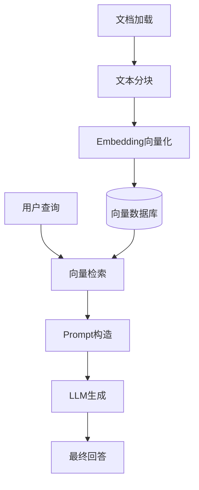

## 1.什么是RAG?

RAG(检索增强生成)是一种将信息检索与文本生成相结合的技术架构。
在LLM生成回答之前，先从外部知识库中检索相关文档片段，然后将检索结果作为上下文注入到Prompt中，让LLM基于这些外部知识生成更准确、更具时效性的回答。

## 2.RAG与传统LLM应用的核心区别

| 维度 | 纯LLM应用 | RAG应用|
| --- | ---| ---|
| 知识来源 | 仅训练数据（静态、有截止日期） | 外部知识库（动态、可实时更新）|
| 幻觉控制 | 依赖 Prompt 约束，容易编造 |  答案有据可查，可溯源|
| 知识更新 | 需重新训练/微调 | 更新文档即可生效 |
| 可解释性 | 黑盒生成 | 可引用来源文档|
| 适用场景 | 通用对话、创意写作|专业问答、企业知识库、个人博客检索|

## 3.RAG核心组件架构

````markdown

````

## 4.RAG工作流程
- 文档解析：读取PDF、Markdown、HTML等各种格式，提取文本内容
- 文本分块：将长文档按语义边界切分为合适大小的chunk，常用策略有固定大小分块、递归分块、语义分块
- Embedding（向量化）：用Embedding模型将每个chunk转化为高维向量，语义相近的文本在向量空间中距离更近
- 向量检索：用户查询同样转为向量，在向量数据库中通过余弦相似度/欧氏距离找到最相似的 Top-K 个 chunk
- Rerank（重排序） — 用更强的交叉编码器模型对检索结果二次排序，提升相关性
- 上下文构造 — 将检索到的 chunk 与用户问题拼接成 Prompt 模板
- 引用溯源 — 在生成的回答中标注信息来源，增加可信度


## 5.关键技术指标
|指标|含义|衡量方式|
|---|---|---|
|检索准确率(Recall@K)|Top-K 结果中包含相关文档的比例|人工标注 + 自动评估|
|生成相关性|回答与问题的匹配程度|LLM-as-Judge/人工评分|
|回答忠实度|回答是否基于检索到的文档而非模型自身知识|逐句校验是否可在文档中找到依据|
|上下文利用率|检索到的文档是否被有效利用|检查生成内容与检索内容的覆盖度|

## 6.个人思考与反思

### 思考一：Markdown 标题是天然的分块边界
```markdown
在构建个人博客 RAG 系统时，我意识到一个关键问题：如何切分文档？

我的答案是 按标题层级分块，而非固定字数 。博客文章使用 Markdown 编写，天然带有 # 、 ## 、 ### 等标题结构，每个标题下是一个语义完整的段落单元。按标题分块能保证内容的完整性和连贯性，而按固定 500 字切分则可能把一段论述从中间截断，大大降低检索准确性。

不过我也意识到潜在问题：如果一篇博客中嵌入了代码块，代码块被单独切分出来后脱离了上下文，LLM 检索到它时还能准确理解吗？ 实际上，答案是不能。 LLM 虽然能解析代码语法，但无法理解代码块的业务意图和使用场景，这会严重影响回答质量。因此分块时必须确保代码块与其解释文字保持在同一 chunk 中，或者通过重叠分块、元数据关联等方式保留上下文关系——这也是后续实践中需要重点验证的。
```
### 思考二：语义搜索是什么，以及它为什么重要
```markdown
坦率地说，我一开始并不理解"语义搜索"是什么意思。后来我搞明白了：传统关键词搜索是"字面匹配"——你搜"部署"，它就只找包含"部署"两个字的文章。而语义搜索基于向量相似度，理解的是"意思"——你搜"怎么把项目放到服务器上"，它也能找到标题为"部署指南"的文章，即使这篇文章里根本没有"放到服务器上"这几个字。

这对个人博客场景意义重大。我经常遇到这种尴尬：明明写过某篇文章，但搜关键词就是搜不到，因为当时用的表述和现在脑子里想的不一样。语义搜索恰好弥补了"用户表达"和"文档内容"之间的语义鸿沟。
```
### 思考三：系列文章之间的关联问题
```markdown
我之前认为系列文章不会丢失上下文，因为"关键词会把涉及的文章都检索到"。但仔细想想，这个假设不成立。

关键词检索依赖的是"词匹配"，如果系列文章用了不同的标题表述——比如上篇叫"Docker 入门"，下篇叫"容器编排实战"——关键词"Docker"就搜不到下篇。这正是语义搜索的价值所在：它能理解"Docker"和"容器编排"之间的语义关联，即使两篇文章用词不同，也能建立起检索关系。

这也提醒我，如果未来写系列文章，最好在每篇文章中显式引用前后篇的链接，或者在分块时通过元数据标记文章之间的关联关系，帮助 RAG 系统更好地覆盖完整知识链。
```
### 思考四：RAG 的多轮对话能力不是"模拟人类思维"
```markdown
我最初认为 RAG 需要"模拟人类的说话方式和思维"，但这其实是一种误解。RAG 系统并不模拟人类思维，它的多轮对话能力是通过 工程手段 实现的，主要包括三个层面：

1. 对话历史管理 ：将前几轮对话作为上下文拼入 Prompt，让 LLM 理解当前问题的背景
2. 查询改写（Query Rewriting） ：将"那个怎么部署的"这种模糊问题，结合历史对话改写成"NestJS 项目的 Docker 部署方法"
3. 追问机制 ：当检索结果置信度不足时，主动向用户追问以澄清意图
这本质上是一个信息处理流程，而非"模拟思维"。理解这一点很重要：RAG 的强大之处在于工程架构的合理设计，而非对人类的模仿。
```
### 思考五：作为内容创作者的矛盾心态
```markdown
最后一个思考点比较个人化：作为用户，我其实乐意让 RAG 帮我整理答案，省去了翻找文章的时间。但作为博主，我心情复杂。

一方面，如果 AI 直接生成答案而不引导用户阅读原文，我的博客就失去了流量和互动。另一方面，我的博客内容并非权威，如果 AI 基于我的文章生成回答，而我的观点本身有局限，最终可能误导用户，削弱读者的独立思考。

我认为理想的方案是"双赢"：AI 引用我的内容时，附上原文链接和出处。这其实就是 RAG 工作流中的引用溯源（Source Attribution）环节——在生成回答时标注信息来源。这样用户既能获得快速答案，也能溯源到原始文章进行深入阅读，既尊重了创作者的劳动，也保证了信息的可验证性。
```