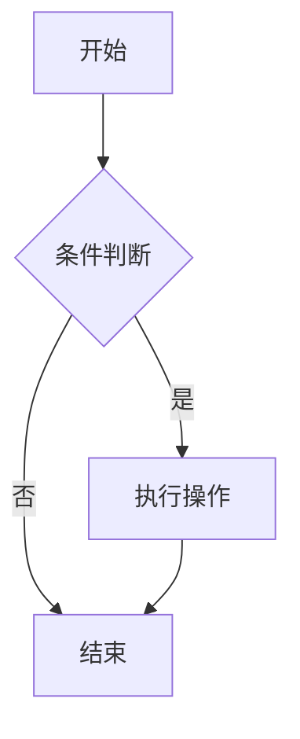

## 一、什么是 Markdown

Markdown 是一种**轻量级标记语言**，由 John Gruber 于 2004 年创建。它使用纯文本格式编写，通过简单的符号标记来实现排版，最终可以转换为结构化的 HTML 文档。

**核心优势**：

- 纯文本编写，任何编辑器都能打开
- 语法简洁，学习成本低
- 专注于内容而非排版
- 可转换为 HTML、PDF 等多种格式
- 广泛用于博客、文档、README、论坛等场景

> **扩展说明**：本文基于 **CommonMark** 规范和 **GitHub Flavored Markdown (GFM)** 扩展编写，涵盖大多数现代 Markdown 编辑器（如 VS Code、Typora、Obsidian）和博客平台（如 GitHub Pages、Hexo、Hugo）所支持的语法。

---

## 二、标题

### 2.1 基本语法

使用 `#` 号标记标题，`#` 的数量表示标题级别（1~6 级），`#` 后需有一个空格。

```markdown
# 一级标题
## 二级标题
### 三级标题
#### 四级标题
##### 五级标题
###### 六级标题
```

**渲染效果**：

# 一级标题
## 二级标题
### 三级标题
#### 四级标题
##### 五级标题
###### 六级标题

### 2.2 替代写法（仅一二级）

一级和二级标题有等价的 Setext 风格写法（仅部分编辑器支持）：

```markdown
一级标题
=======

二级标题
-------
```

### 2.3 注意事项

| 要点 | 说明 |
| ---- | ---- |
| `#` 后空格 | 必须有，否则某些解析器不会将其识别为标题 |
| 标题层级 | 建议不超过三级嵌套，层级过深反而影响阅读 |
| 一级标题 | 一个页面通常只有一个一级标题（文章标题） |
| 空行 | 标题前后建议各留一个空行，增强可读性 |

---

## 三、段落与换行

### 3.1 段落

Markdown 中，连续的行构成一个段落，段落之间用**空行**分隔。

```markdown
这是第一段文字。同一个段落内的换行，
在渲染后会被合并为一行。

这是第二段文字。因为中间有一个空行，
所以它成为独立的段落。
```

### 3.2 换行

**方式一：行末加两个空格**

在行末添加两个空格后再回车，可实现强制换行（`<br>`）。

**方式二：使用 `<br>` 标签**

直接插入 HTML 的 `<br>` 标签强制换行。

### 3.3 注意事项

- 段落内单纯换行（不加两个空格）不会产生换行效果
- 建议段落之间用空行分隔，保持源文件可读性
- 避免滥用 `<br>` 标签，尽量用段落自然分隔内容

---

## 四、文本强调

### 4.1 粗体

用 `**` 或 `__` 包裹文本。

```markdown
这是**粗体文字**，这也是__粗体文字__。
```

渲染：这是**粗体文字**，这也是__粗体文字__。

### 4.2 斜体

用 `*` 或 `_` 包裹文本。

```markdown
这是*斜体文字*，这也是_斜体文字_。
```

渲染：这是*斜体文字*，这也是_斜体文字_。

### 4.3 粗斜体

用 `***` 或 `___` 包裹文本。

```markdown
这是***粗斜体文字***。
```

渲染：这是***粗斜体文字***。

### 4.4 删除线

用 `~~` 包裹文本。

```markdown
这是~~删除线文字~~。
```

渲染：这是~~删除线文字~~。

### 4.5 行内代码

用单个反引号 `` ` `` 包裹文本。

```markdown
使用 `print("hello")` 函数输出内容。
```

渲染：使用 `print("hello")` 函数输出内容。

### 4.6 注意事项

| 要点 | 说明 |
| ---- | ---- |
| 下划线 | Markdown 没有原生下划线语法，用 `<u>下划线</u>` 替代 |
| 高亮 | 部分编辑器支持 `==高亮==`（非标准语法） |
| 嵌套 | 粗体可嵌套斜体，如 `**粗体中的*斜体***` |

---

## 五、列表

### 5.1 无序列表

使用 `-`、`*` 或 `+` 作为标记，后跟一个空格。

```markdown
- 项目一
- 项目二
- 项目三
```

渲染：
- 项目一
- 项目二
- 项目三

### 5.2 有序列表

使用数字 + `.` + 空格开头。

```markdown
1. 第一步
2. 第二步
3. 第三步
```

渲染：
1. 第一步
2. 第二步
3. 第三步

> **提示**：有序列表的数字可以不连续，Markdown 会自动按顺序编号。即你可以全部写成 `1.`，渲染时自动递增。

### 5.3 嵌套列表

在子列表项前加 **4 个空格** 或 **1 个 Tab**。

```markdown
- 一级项目
    - 二级项目
        - 三级项目
1. 第一步
    1. 子步骤一
    2. 子步骤二
2. 第二步
```

渲染：
- 一级项目
    - 二级项目
        - 三级项目
1. 第一步
    1. 子步骤一
    2. 子步骤二
2. 第二步

### 5.4 任务列表（GFM 扩展）

```markdown
- [x] 已完成任务
- [ ] 未完成任务
- [ ] 待办事项
```

渲染：
- [x] 已完成任务
- [ ] 未完成任务
- [ ] 待办事项

### 5.5 列表中的多段落

在列表项中写多段落，需要在后续段落前加缩进对齐：

```markdown
- 第一项

  这是第一项的第二段，前面有缩进。

- 第二项
```

### 5.6 注意事项

| 要点 | 说明 |
| ---- | ---- |
| 缩进一致性 | 同一层级使用相同缩进（推荐 4 空格） |
| 列表后空行 | 列表前后建议各留一个空行 |
| 标记符号 | 无序列表推荐统一使用 `-` |
| 代码块嵌套 | 列表中的代码块需缩进对齐 |

---

## 六、链接

### 6.1 行内链接

```markdown
[链接文字](https://www.example.com)
[带标题的链接](https://www.example.com "鼠标悬停时显示的标题")
```

渲染：[链接文字](https://www.example.com)

### 6.2 参考式链接

适合多次引用同一链接的场景：

```markdown
[Google][1] 和 [GitHub][2] 都是常用网站。

[1]: https://www.google.com
[2]: https://github.com "GitHub 主页"
```

### 6.3 自动链接

用 `<>` 包裹 URL 或邮箱，自动转为可点击链接：

```markdown
<https://www.example.com>
<user@example.com>
```

### 6.4 锚点链接（页内跳转）

```markdown
[跳转到标题](#二标题)
```

### 6.5 注意事项

- 链接文字尽量描述性强，避免"点击这里"这种无意义文字
- URL 中含有括号时需转义：`[link](http://example.com/foo\(bar\))`
- 安全性：不建议直接链接到不可信来源

---

## 七、图片

### 7.1 基本语法

```markdown


```

### 7.2 示例

```markdown

```

### 7.3 图片链接（可点击图片）

```markdown
[](链接URL)
```

### 7.4 控制图片尺寸

Markdown 原生不支持尺寸控制，可通过 HTML 实现：

```html

```

### 7.5 参考式图片

```markdown
![替代文字][image_ref]

[image_ref]: 图片URL
```

### 7.6 注意事项

| 要点 | 说明 |
| ---- | ---- |
| 替代文字 | `alt` 属性必须写，图片加载失败时显示，也用于无障碍阅读 |
| 图片路径 | 本地图片用相对路径，如 `../images/photo.png` |
| 图片大小 | 插入前压缩图片，避免页面加载过慢 |
| 格式选择 | 照片用 JPG，图标/截图用 PNG，动图用 GIF |

---

## 八、代码块

### 8.1 行内代码

用单个反引号包裹：

```markdown
使用 `console.log()` 输出调试信息。
```

### 8.2 围栏代码块

用三个反引号 ` ``` ` 包裹，并指定语言标识符：

````markdown
```python
def hello(name):
    print(f"Hello, {name}!")

hello("World")
```
````

渲染：

```python
def hello(name):
    print(f"Hello, {name}!")

hello("World")
```

### 8.3 缩进代码块

每行前加 4 个空格或 1 个 Tab（不推荐，无语法高亮）：

    def hello():
        print("Hello")

### 8.4 常见语言标识符

| 语言 | 标识符 |
| ---- | ------ |
| Python | `python` |
| JavaScript | `javascript` / `js` |
| TypeScript | `typescript` / `ts` |
| Java | `java` |
| C / C++ | `c` / `cpp` |
| Go | `go` |
| Rust | `rust` |
| HTML | `html` |
| CSS | `css` |
| SQL | `sql` |
| Bash / Shell | `bash` / `shell` |
| YAML | `yaml` |
| JSON | `json` |
| Markdown | `markdown` |
| 无高亮 | `text` 或留空 |

### 8.5 代码块中的反引号

如果代码内容本身包含连续三个反引号，外层使用四个反引号：

`````markdown
````
```python
print("Hello")
```
````
`````

### 8.6 注意事项

- 始终指定语言标识符，获得正确的语法高亮
- 代码块前后各留一个空行
- 保持代码缩进规范，便于阅读

---

## 九、表格

### 9.1 基本语法

```markdown
| 表头1 | 表头2 | 表头3 |
| ----- | ----- | ----- |
| 内容1 | 内容2 | 内容3 |
| 内容4 | 内容5 | 内容6 |
```

渲染：

| 表头1 | 表头2 | 表头3 |
| ----- | ----- | ----- |
| 内容1 | 内容2 | 内容3 |
| 内容4 | 内容5 | 内容6 |

### 9.2 对齐方式

在分隔行使用冒号控制对齐：

```markdown
| 左对齐 | 居中对齐 | 右对齐 |
| :----- | :------: | -----: |
| 文字   | 文字     | 文字   |
| 较长内容 | 较长内容 | 较长内容 |
```

渲染：

| 左对齐 | 居中对齐 | 右对齐 |
| :----- | :------: | -----: |
| 文字   | 文字     | 文字   |
| 较长内容 | 较长内容 | 较长内容 |

**对齐规则**：

| 语法 | 效果 |
| ---- | ---- |
| `:---` | 左对齐（默认） |
| `:---:` | 居中对齐 |
| `---:` | 右对齐 |

### 9.3 表格内换行

使用 `<br>` 标签在单元格内换行：

```markdown
| 列1 | 列2 |
| --- | --- |
| 第一行<br>第二行 | 内容 |
```

### 9.4 表格中插入特殊字符

需要显示竖线 `|` 时，使用 `&#124;` 转义：

```markdown
| 操作符 | 说明 |
| ------ | ---- |
| &#124;  | 管道符 |
```

### 9.5 注意事项

| 要点 | 说明 |
| ---- | ---- |
| 列数一致 | 每行的列数必须一致 |
| 分隔行 | 表头与内容之间的分隔行（`|---|`）不可省略 |
| 管道对齐 | 管道符 `|` 对齐不是必须的，但强烈建议对齐以提升可读性 |
| 复杂表格 | 极复杂的表格建议用 HTML `<table>` 代替 |
| 空单元格 | 直接留空即可 |

---

## 十、引用

### 10.1 基本语法

使用 `>` 开头：

```markdown
> 这是一段引用文字。
```

渲染：

> 这是一段引用文字。

### 10.2 多段落引用

```markdown
> 第一段引用。
>
> 第二段引用（注意空行也要加 >）。
```

### 10.3 嵌套引用

```markdown
> 一级引用
>> 二级引用
>>> 三级引用
```

渲染：

> 一级引用
>> 二级引用
>>> 三级引用

### 10.4 引用中嵌套其他元素

引用块内可以包含标题、列表、代码块等：

```markdown
> ### 引用中的标题
>
> - 列表项1
> - 列表项2
>
> ```python
> print("引用中的代码")
> ```
```

### 10.5 注意事项

- `>` 后需有一个空格
- 引用中嵌套代码块需要额外缩进或添加 `>` 前缀
- 空行也要加 `>` 才能保持引用连续性

---

## 十一、分割线

### 11.1 语法

三种写法，效果相同：

```markdown
---
***
___
```

渲染（三条效果相同）：

---

### 11.2 注意事项

| 要点 | 说明 |
| ---- | ---- |
| 数量 | 至少三个连续的 `-`、`*` 或 `_` |
| 空行 | 前后各留一个空行，避免被误解析为标题 |
| `---` 注意 | 单独一个 `---` 可能被解析为二级标题（Setext 风格），建议前后加空行规避 |
| 推荐使用 | `---` 最常用 |

---

## 十二、脚注（GFM 扩展）

### 12.1 语法

在文中标注脚注引用，在文末定义脚注内容：

```markdown
这是一段带有脚注的文字[^1]。

[^1]: 这是脚注的具体内容。
```

### 12.2 示例

```markdown
Markdown 由 John Gruber 创建[^gruber]，后来被广泛扩展[^gfm]。

[^gruber]: John Gruber，美国作家、博客作者，Daring Fireball 网站创始人。
[^gfm]: GitHub Flavored Markdown，GitHub 对 Markdown 的扩展规范。
```

### 12.3 注意事项

- 脚注标识符可以是数字或单词
- 脚注定义可以放在文档任意位置（通常放在文末），渲染时自动汇总到页面底部
- 不是所有平台都支持脚注（如某些静态博客主题需额外配置）

---

## 十三、HTML 标签

Markdown 支持在文档中直接插入 HTML 标签，实现更复杂的排版：

```markdown
这是 <u>下划线文字</u>，这是 <span style="color:red;">红色文字</span>。

<details>
<summary>点击展开查看详情</summary>

这里是折叠的内容。

</details>
```

### 13.1 常用场景

| 场景 | HTML 代码 |
| ---- | --------- |
| 下划线 | `<u>文字</u>` |
| 上标 | `X<sup>2</sup>` |
| 下标 | `H<sub>2</sub>` |
| 居中 | `<center>文字</center>` |
| 折叠 | `<details><summary>标题</summary>内容</details>` |
| 按键 | `<kbd>Ctrl</kbd> + <kbd>C</kbd>` |
| 图片尺寸 | `` |

### 13.2 注意事项

- HTML 块级元素前后需要空行
- HTML 块内不支持 Markdown 语法（不同解析器表现不一）
- 不要滥用 HTML，尽量用 Markdown 原生语法

---

## 十四、转义字符

### 14.1 反斜杠转义

在 Markdown 特殊字符前加 `\` 显示原字符：

```markdown
\* 这不是斜体 \*
\# 这不是标题
\` 这不是代码
```

### 14.2 需要转义的字符

| 字符 | 名称 | 转义写法 |
| ---- | ---- | -------- |
| `\` | 反斜杠 | `\\` |
| `` ` `` | 反引号 | `` \` `` |
| `*` | 星号 | `\*` |
| `_` | 下划线 | `\_` |
| `{}` | 花括号 | `\{\}` |
| `[]` | 方括号 | `\[\]` |
| `()` | 圆括号 | `\(\)` |
| `#` | 井号 | `\#` |
| `+` | 加号 | `\+` |
| `-` | 减号 | `\-` |
| `.` | 句号 | `\.` |
| `!` | 感叹号 | `\!` |
| `|` | 管道符 | `\|` |

---

## 十五、目录生成

### 15.1 手动创建目录

```markdown
- [一、什么是 Markdown](#一什么是-markdown)
- [二、标题](#二标题)
  - [2.1 基本语法](#21-基本语法)
  - [2.2 替代写法](#22-替代写法)
- [三、段落与换行](#三段落与换行)
```

**锚点规则**：

- 标题文字转为小写
- 空格替换为 `-`
- 移除标点符号（如 `.` `,` `?`）
- 中文标题通常保留原样（取决于平台对中文锚点的处理）

### 15.2 自动生成

许多 Markdown 编辑器支持自动生成目录：

| 工具 | 方式 |
| ---- | ---- |
| VS Code | 安装 `Markdown All in One` 插件，使用 `Ctrl+Shift+P` → "Create Table of Contents" |
| Typora | 右键 → 插入 → 目录 |
| Obsidian | 使用 `[[## 标题]]` 语法 |
| Jekyll | 在 Front Matter 中设置 `toc: true` |

---

## 十六、数学公式（LaTeX 扩展）

部分平台支持用 LaTeX 语法嵌入数学公式：

### 16.1 行内公式

```markdown
质能方程 $E = mc^2$ 非常著名。
```

### 16.2 块级公式

```markdown
$$
\int_{0}^{\infty} e^{-x^2} \, dx = \frac{\sqrt{\pi}}{2}
$$
```

### 16.3 注意事项

- 需要平台或编辑器支持（如 Typora、Obsidian、Jekyll + MathJax）
- GitHub 原生不支持数学公式渲染
- 常用 LaTeX 命令：`\frac{a}{b}` 分数、`\sqrt{x}` 平方根、`\sum_{i=1}^{n}` 求和

---

## 十七、流程图与图表（Mermaid 扩展）

许多平台（GitHub、GitLab、Notion）支持用 Mermaid 语法绘制图表：

````markdown

````

**支持的类型**：流程图（flowchart）、时序图（sequence diagram）、甘特图（gantt）、饼图（pie）等。

---

## 十八、Emoji 表情

### 18.1 简码方式（GFM 扩展）

```markdown
:smile: :heart: :+1: :rocket:
```

常用简码：`:smile:` 😄、`:heart:` ❤️、`:+1:` 👍、`:warning:` ⚠️、`:bulb:` 💡、`:memo:` 📝

### 18.2 直接粘贴

直接复制粘贴 Emoji 也是完全支持的。

---

## 十九、最佳实践与排版建议

### 19.1 源文件排版

| 规则 | 说明 |
| ---- | ---- |
| 标题前后空行 | 每个标题前后各留一个空行 |
| 不同元素间空行 | 列表、代码块、表格、引用等块级元素前后各留空行 |
| 一行一内容 | 每个段落、列表项独占一行，源文件也要可读 |
| 合理缩进 | 嵌套内容保持缩进一致性 |
| 文件末尾空行 | 建议源文件末尾留一个空行 |

### 19.2 内容结构建议

```
# 文章标题
简短引言

## 大章节1
### 小节1.1
### 小节1.2

## 大章节2
### 小节2.1

## 总结
```

### 19.3 常见错误

| 错误 | 正确做法 |
| ---- | -------- |
| `#标题` 无空格 | `# 标题` |
| 列表标记后无空格 | `- 项目` |
| 代码块未指定语言 | ` ```python ` |
| 表格分隔行遗漏 | 必须写 `|---|` |
| 链接圆括号不匹配 | 检查括号配对 |
| 标题层级跳跃 | 不要从 `#` 直接跳到 `###` |

### 19.4 推荐工具

| 工具 | 用途 | 特点 |
| ---- | ---- | ---- |
| VS Code | 编辑器 | 免费，插件丰富，实时预览 |
| Typora | 专用编辑器 | 所见即所得，付费 |
| Obsidian | 知识管理 | 双向链接，本地存储 |
| Markdown All in One | VS Code 插件 | 自动补全、目录生成、格式化 |
| markdownlint | VS Code 插件 | 语法检查，规范提醒 |

---

## 二十、速查表

| 元素 | 语法 |
| ---- | ---- |
| 标题 | `# H1` `## H2` `### H3` |
| 粗体 | `**粗体**` |
| 斜体 | `*斜体*` |
| 删除线 | `~~删除线~~` |
| 行内代码 | `` `代码` `` |
| 无序列表 | `- 项目` |
| 有序列表 | `1. 项目` |
| 任务列表 | `- [x] 完成` |
| 链接 | `[文字](URL)` |
| 图片 | `` |
| 引用 | `> 引用` |
| 分割线 | `---` |
| 代码块 | ` ```语言 ` |
| 表格 | `| 列1 | 列2 |` |
| 脚注 | `[^1]` |
| 转义 | `\*` |

---

## 二十一、总结

Markdown 的设计哲学是**让写作者专注于内容，而非排版**。相比 Word 等富文本编辑器，Markdown 的优势在于：

1. **纯文本存储** — 永不担心文件格式兼容问题
2. **语法简洁** — 半小时即可掌握核心语法
3. **专注内容** — 写作时手不离键盘，不必反复操作鼠标
4. **版本控制** — 纯文本文件天然适合 Git 管理
5. **多格式输出** — 可轻松转换为 HTML、PDF、Word 等格式

学习建议：

- **先掌握核心语法**：标题、段落、列表、链接、图片、代码块、表格，这七项覆盖 90% 的写作场景
- **边写边学**：不要死记硬背，打开编辑器边写边查，熟练后自然形成肌肉记忆
- **善用工具**：安装一个支持实时预览的编辑器，能看到即时渲染效果
- **参考规范**：遇到不确定的语法，查阅 [CommonMark 规范](https://commonmark.org/) 或 [GitHub Flavored Markdown 规范](https://github.github.com/gfm/)

---

*本文为个人学习 Markdown 格式的完整笔记，基于 CommonMark + GFM 规范编写，涵盖所有日常写作所需的格式语法。*