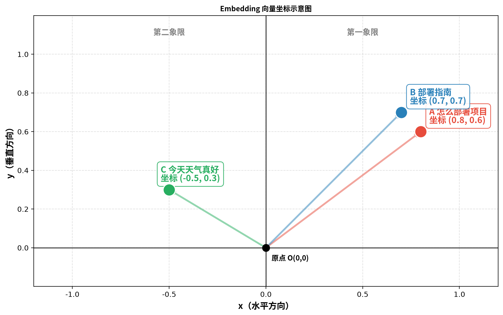

## 1. 从一个问题开始

RAG 系统的核心操作是：用户问一个问题，系统从知识库里找到最相关的文档片段。

但"找到最相关"这件事，计算机是怎么做的？它能把文字的含义变成数字，然后比较数字。

这篇文章就是来搞清楚这个"比较"的过程。

## 2. 向量：把文字变成坐标

### 2.1 什么是向量

当一段文字通过 Embedding 模型（比如 `text-embedding-3-small`）处理后，会得到一串数字：

```
"怎么部署项目" → [0.8, 0.6, 0.3, -0.1, ...]
```

这串数字就是**向量**。它有 1536 个数字——这个数字是 OpenAI 在设计模型时选定的，是精度和速度之间的平衡。

### 2.2 把向量理解为坐标

1536 个数字不好想象，压缩到 2 个数字来理解：把向量当成平面上的一个**坐标 (x, y)**。

比如三个文本的向量：

- "怎么部署项目" → (0.8, 0.6)
- "部署指南" → (0.7, 0.7)
- "今天天气真好" → (-0.5, 0.3)

画在坐标系上：



### 2.3 坐标怎么读

- (0.8, 0.6)：从原点向右走 0.8，向上走 0.6 → 第一象限
- (-0.5, 0.3)：从原点向**左**走 0.5（负号），向上走 0.3 → 第二象限

一眼就能看出来：两个"部署"相关的点挤在右上角，"天气"那个点孤零零在左边。这就是向量检索的直觉：**语义相近的文字，在向量空间中距离也近**。

## 3. 三种衡量"距离"的方法

### 3.1 余弦相似度：看方向

给每个点从原点画一条箭头。余弦相似度只问一个问题：

> 这两条箭头指向同一个方向吗？

- "怎么部署项目"的箭头指向右上
- "部署指南"的箭头也指向右上 → 方向几乎一致 → 高相似度
- "今天天气真好"的箭头指向左上 → 方向完全不同 → 低相似度

余弦相似度**只看方向，不看箭头的长度**。范围是 -1 到 1：1 是方向完全相同，0 是垂直（无关），-1 是完全相反。

### 3.2 欧氏距离：拿尺子量

欧氏距离换了一种思路：

> 两个点之间的直线距离有多远？

- 两个"部署"点之间距离很近 → 相似
- "部署"和"天气"之间距离很远 → 不相似

### 3.3 点积：方向 + 长度一起算

点积同时考虑方向和长度。但这里有一个关键前提——**归一化**。

## 4. 归一化：让所有向量在同一条起跑线上

### 4.1 为什么需要归一化

不同文本的向量长度可能不同。长文本的向量数值更大，短文本的向量数值更小。如果不归一化，点积会天然偏向长文本——这不公平。

归一化做的事情很简单：**把所有向量拉到同一个长度（长度为 1），只保留方向信息**。

### 4.2 归一化后的等价关系

归一化后，一个重要的数学关系成立：

```
欧氏距离² = 2 - 2 × 余弦相似度
```

这意味着：**余弦相似度高了，欧氏距离就低了，反之亦然。** 两者一一对应，用哪个排序，结果完全一样。

同时，归一化后余弦相似度等于点积。这就是为什么日常使用中，这三种方法经常被混着说——归一化后它们等价。

### 4.3 哪些模型默认归一化

| 模型 | 默认归一化？ |
|------|------------|
| OpenAI `text-embedding-3-small/large` | 是 |
| OpenAI `text-embedding-ada-002` | 是 |
| Cohere `embed-v3` | 是 |
| `bge-large-zh`（BAAI） | **否，需要手动归一化** |

开源模型是否默认归一化，各不一样，使用前需要看文档确认。

## 5. Embedding 模型是怎么把文字变成向量的

Embedding 模型本质上是一个训练好的神经网络。训练过程大致是：

```
训练数据：几亿对"相似文本"和"不相似文本"
例如：
  "如何部署项目" ↔ "项目部署指南"  → 拉近（相似）
  "如何部署项目" ↔ "今天天气真好"  → 推远（不相似）

模型学习的目标：
  语义相似的文字 → 向量方向接近
  语义不相似的文字 → 向量方向远离
```

训练完成后，模型内部记住了大量"词语和语义之间的关系"。当你输入一句话，它经过层层计算，最终输出 1536 个数字。

**那 1536 个数字各自代表什么？** 没有一个数字单独代表"部署"，也没有一个数字单独代表"Docker"。每个数字是所有语义特征的综合表达。就像人脸表情——没有一个部位单独代表"开心"，但嘴角、眼角、眉毛同时变化，组合起来就是"开心"。

## 6. Score 阈值与 Rerank：两道防线

### 6.1 Score 阈值：第一道防线

在 Dify 中设置的 Score 阈值（比如 0.3），意思是：余弦相似度低于 0.3 的 chunk，直接丢弃。

**它能做什么**：挡住方向明显不同的 chunk。

**它不能做什么**：挡不住"方向接近但内容无关"的情况。比如你的博客中多篇文章都包含 Docker、Redis 等术语，它们的向量方向可能很接近，但内容主题完全不同。

### 6.2 Rerank：第二道防线

Rerank 模型不用向量比较，而是把用户查询和每个候选 chunk 拼在一起，逐字逐句地做阅读理解，然后打分。

```
向量检索（快，粗筛）→ 召回一批候选
         ↓
Rerank（慢，精排）→ 从候选中挑出最相关的
         ↓
喂给 LLM
```

**为什么 Rerank 更准？** 向量检索把整段文字压缩成 1536 个数字，必然丢失细节。Rerank 直接读原文，能理解"这段话虽然提到了 Redis，但主题是 Nginx 部署"这种细微差别。

**代价**：更慢、更贵。所以实际流程是向量先粗筛，Rerank 再精排，兼顾速度和精度。

## 7. 总结

| 概念 | 一句话理解 |
|------|-----------|
| 向量 | 文字变成的一串数字，代表空间中的坐标 |
| 余弦相似度 | 看方向，方向越接近越相似 |
| 欧氏距离 | 量直线距离，归一化后和余弦等价 |
| 归一化 | 把所有向量拉到一样长，让比较更公平 |
| 1536 维 | OpenAI 的设计选择，精度和速度的平衡 |
| Embedding 原理 | 训练好的神经网络：相似语义 → 方向接近 |
| Score 阈值 | 挡方向差太远的，挡不住方向接近但内容无关的 |
| Rerank | 逐字精读，弥补向量检索的精度损失 |

核心原则：**RAG 的每个组件选择都没有绝对的最优解，必须根据具体场景反复实验验证。更重要的是，先搞清楚当前规模下真正的瓶颈在哪，再决定在哪用力。**

---

## 个人思考

学之前，我对检索方式的概念是模糊的，只知道 Dify 里三种检索方式是必选项，但不知道每种用在什么场景下。现在知道向量检索是语义匹配，全文检索是关键词匹配，混合检索是两者结合。我的博客术语密集（Docker、Nginx、Redis 反复出现），向量检索就够用了。

调 Score 阈值能挡住方向差太远的 chunk，但挡不住方向接近但内容无关的。现在大部分 Embedding 模型都默认归一化，所以余弦相似度和点积等价，不需要纠结选哪个。这个问题需要 Rerank 来二次筛选——但在 5 篇文章的规模下，Rerank 也看不出效果。