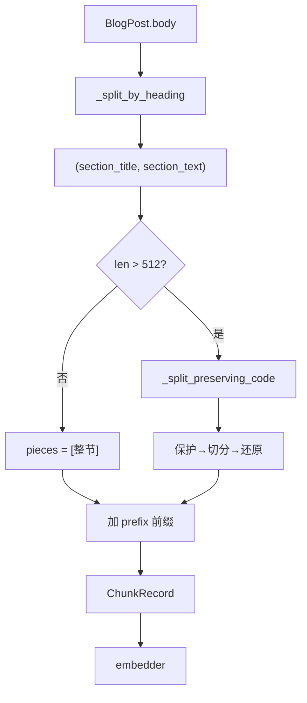

> **对照阅读：chunker.py 源码**
>
> | | |
> | --- | --- |
> | 仓库内路径 | `rag-backend/app/ingestion/chunker.py` |
> | GitHub 原文 | [打开 chunker.py（main 分支）](https://github.com/123XH-sudo/123xh-sudo.github.io/blob/main/rag-backend/app/ingestion/chunker.py) |
> | 上一篇 | [逐行解读 loader.py]() |
> | 练习脚本 | [`python_basics_for_chunker.py`](https://github.com/123XH-sudo/123xh-sudo.github.io/blob/main/rag-backend/scripts/python_basics_for_chunker.py) |
>
> 下文按源码结构解读，每节附**行号链接**。文中穿插**学习过程中的真实困惑与突破**，不是纯技术手册。

## 1. chunker 在流水线中的位置

```
_posts/*.md  →  loader  →  chunker  →  embedder  →  store (Chroma)
                              ↑
                           本文
```

[`loader.py`](https://github.com/123XH-sudo/123xh-sudo.github.io/blob/main/rag-backend/app/ingestion/loader.py) 输出 `BlogPost`，[`chunker.py`](https://github.com/123XH-sudo/123xh-sudo.github.io/blob/main/rag-backend/app/ingestion/chunker.py) 把 `post.body` 切成多个 **`ChunkRecord`**。本仓库 13 篇文章切出 **179 个 chunk**。

## 2. 学习背景：loader 读懂了，chunker 又卡住了

读完 [loader 那篇]() 之后，我以为 Phase 2 的数据处理已经过关。打开 `chunker.py` 才发现难度跳档——**同时卡在三件事上**：

1. **英文变量名**：`placeholders`、`protected`、`restored`… 不知道在干什么
2. **Python 语法**：嵌套函数、`re.sub` 回调、三元表达式、`dict.items()`…
3. **变量类型**：`sections` 是列表吗？`_HEADING_SPLIT_RE` 里存的是字符串还是切完的结果？

一度看到第 39 行就「看不下去了」。

### 我的读码策略

沿用 loader 的经验：**不系统学 Python，只学读懂这一篇**；写了一个 6 课练习脚本 [`python_basics_for_chunker.py`](https://github.com/123XH-sudo/123xh-sudo.github.io/blob/main/rag-backend/scripts/python_basics_for_chunker.py)，一课对应一个卡点。

另一个关键决定：**先只读 `chunk_post`（80–116 行）**，两个 `_split_` 函数当黑盒——知道输入输出就行，细节后面再打开。这个策略让我先建立了整体图景，没有在第一处正则就放弃。

## 3. 为什么需要两阶段分块？

→ 源码 [第 1–9 行](https://github.com/123XH-sudo/123xh-sudo.github.io/blob/main/rag-backend/app/ingestion/chunker.py#L1-L9)

| 策略 | 优点 | 缺点 |
| --- | --- | --- |
| 只按 `##` 标题 | 语义完整 | 单节超长，超出 embedding 有效窗口 |
| 只按固定长度 | 长度可控 | 可能在代码块/段落中间截断 |
| **先标题、再递归** | 两者兼顾 | 实现稍复杂 |

参数：`chunk_size=512`，`chunk_overlap=64`。后者我一开始完全不懂——见第 7 节。

## 4. ChunkRecord：一个 chunk 长什么样

→ 源码 [第 21–30 行](https://github.com/123XH-sudo/123xh-sudo.github.io/blob/main/rag-backend/app/ingestion/chunker.py#L21-L30)

```python
@dataclass
class ChunkRecord:
    chunk_id: str
    content: str           # 入库文本（含标题前缀）
    source_file: str
    post_title: str
    post_date: str
    post_tags: str         # 逗号连接，Chroma 不支持 list
    section_title: str
    char_count: int
```

**思考：** 和 `BlogPost` 的关系现在清楚了——loader 产出「一整篇」，chunker 产出「很多小块」。读代码时先找「输入 `BlogPost`、输出 `list[ChunkRecord]`」，后面每一行都是为这个服务的。

## 5. 两个正则工具：我最大的误解之一

→ 源码 [第 33–34 行](https://github.com/123XH-sudo/123xh-sudo.github.io/blob/main/rag-backend/app/ingestion/chunker.py#L33-L34)

```python
_CODE_BLOCK_RE = re.compile(r"```[\s\S]*?```", re.MULTILINE)
_HEADING_SPLIT_RE = re.compile(r"\n(?=## )")
```

### 当时的困惑

我一开始把这两行理解成 C 语言里的「子串变量」——以为 `_HEADING_SPLIT_RE` 里已经存了切完的内容。其实：

```python
type(_HEADING_SPLIT_RE)  # <class 're.Pattern'>  → 是「工具」，不是结果
type(sections)           # <class 'list'>         → .split() 之后才是切完的结果
type(sections[0])        # <class 'str'>          → 每个元素是字符串
```

**`.split(body)` 的返回值**才存在 `sections` 里。工具和使用结果要分开想。

### `_HEADING_SPLIT_RE.split(body)` 切完长什么样

输入 body：

```markdown
文章开头，还没有标题。
## 什么是 RAG
RAG 是检索增强生成。
## 架构设计
这里有流程图。
```

```python
sections = _HEADING_SPLIT_RE.split(body)
# sections 是 list，len=3
# sections[0] → '文章开头，还没有标题。'
# sections[1] → '## 什么是 RAG\nRAG 是检索增强生成。'
# sections[2] → '## 架构设计\n这里有流程图。'
```

### 怎么随时查类型？

这是第 1 课练会的，读 chunker 时救了我：

```python
print(type(sections))      # list
print(len(sections))       # 几个元素
print(repr(sections[1]))   # 看清 \n 和 ##
```

## 6. _split_by_heading：从 list[str] 到 list[tuple]

→ 源码 [第 37–48 行](https://github.com/123XH-sudo/123xh-sudo.github.io/blob/main/rag-backend/app/ingestion/chunker.py#L37-L48)

```python
def _split_by_heading(body: str) -> list[tuple[str, str]]:
    sections = _HEADING_SPLIT_RE.split(body)
    result: list[tuple[str, str]] = []
    for section in sections:
        section = section.strip()
        if not section:
            continue
        m = re.match(r"^## (.+)", section)
        title = m.group(1).strip() if m else "（无标题）"
        result.append((title, section))
    return result
```

**思考：** 第 39 行的 `sections` 和第 40 行的 `result` 类型不同——前者是 `list[str]`，后者是 `list[tuple[str, str]]`。多出来的 `(title, section)` 元组，是为了后面 `chunk_post` 一行拆包：

```python
for section_title, section_text in _split_by_heading(post.body):
```

loader 里学过 tuple 拆包，这里算是用上了。

## 7. chunk_overlap：「关键句卡边界」到底长什么样？

→ 对应 [第 82–83 行](https://github.com/123XH-sudo/123xh-sudo.github.io/blob/main/rag-backend/app/ingestion/chunker.py#L82-L83) 的参数

这是我问得最具体的问题之一：**overlap 解决的「关键句卡边界」，能不能看到一个例子？64 字够不够？**

### 卡边界的样子

假设 `chunk_size=100`，**无 overlap**，像切香肠硬切：

```
chunk1: ...铺垫铺垫【关键：RAG=检索+生
chunk2: 成，不是微调。】后续后续...
```

用户搜「RAG 检索增强生成」时，两个 chunk 各只有半句，**单独检索都匹配不好**——这就是「关键句卡在边界上」。

### overlap 怎么救

`chunk_overlap=64`：切下一刀时往回多留 64 字，相邻 chunk 有一段重复。整句更可能完整地出现在某一个 chunk 里。

### 64 够吗？

诚实说：**是经验默认值，不是魔法数字**。64 个中文字大约 1～2 句话，能缓解很多边界问题，但不能保证 100%。我现在的理解是——**用一点存储和计算换检索稳定性**，以后可以拿 128 做对比实验。短 section（≤512 字）根本不会二次切分，overlap 对它们无影响。

## 8. _split_preserving_code：最难的一段，也是最后想通的

→ 源码 [第 51–77 行](https://github.com/123XH-sudo/123xh-sudo.github.io/blob/main/rag-backend/app/ingestion/chunker.py#L51-L77)

6 课里第 6 课才打开这段。注释说「递归分块」，我最初以为 Python 函数在调用自己——其实 **「递归」指的是 LangChain 的 `RecursiveCharacterTextSplitter`** 按 `\n\n` → `\n` → `。` → 空格 → 硬切 的优先级切分，不是 `def` 自己调自己。

### 三步流水线

```
text → ① 代码块换占位符 → ② LangChain 切分 → ③ 占位符换回代码块
```

### ③ 还原：`restored` 一开始是空的，怎么就有内容了？

这是我最纠结的一问。想通之后用自己的话总结：

> **`restored` 从空列表开始，分块内容一块一块往里放；每次放进去之前，对该块做 `replace`，把 `__CODE_0__` 换回完整代码。**

对应代码：

```python
restored: list[str] = []                   # 空列表，正常
for part in parts:                         # 逐个处理
    for key, code in placeholders.items():
        part = part.replace(key, code)     # 有占位符就还原
    restored.append(part)                  # 一块一块 append
return restored
```

不是「一次性变出来」，而是循环里 **append 了 len(parts) 次**。内层循环不是先 `if` 判断有没有占位符，而是对每个 key 直接 `replace`——没有占位符时字符串不变，有就换掉。

### 嵌套函数、`re.sub` 回调

`_protect` 写在函数里面、由 `re.sub` 每匹配一个代码块调一次——这些语法第 6 课才细讲。**第一遍读 chunker 可以只知道结论：保护代码块不被切烂。**

## 9. chunk_post：主流程（我的阅读重点）

→ 源码 [第 80–116 行](https://github.com/123XH-sudo/123xh-sudo.github.io/blob/main/rag-backend/app/ingestion/chunker.py#L80-L116)

黑盒策略下，我主要盯这几行：

```python
for section_title, section_text in _split_by_heading(post.body):
    prefix = f"【{post.post_title} > {section_title}】\n"
    pieces = (
        [section_text]
        if len(section_text) <= chunk_size
        else _split_preserving_code(section_text, chunk_size, chunk_overlap)
    )
    for piece in pieces:
        chunk_index += 1
        content = prefix + piece.strip()
        records.append(ChunkRecord(...))
```

**思考：** 读到这里时，我给自己画了一条线——

```
按标题循环 → 加前缀 → 短的不切 / 长的调黑盒 → 每个 piece 包成 ChunkRecord
```

上面两个 `_split_` 函数都是为这条线服务的。先懂主线，再回头抠细节，比从第 33 行逐行硬啃轻松很多。

[`pipeline.py`](https://github.com/123XH-sudo/123xh-sudo.github.io/blob/main/rag-backend/app/ingestion/pipeline.py) 调用：

```python
chunks = chunk_post(post, chunk_size=512, chunk_overlap=64)
texts = [c.content for c in chunks]
embeddings = embed_texts(texts)
```

## 10. 完整数据流



## 11. 验证

```python
from pathlib import Path
from app.ingestion.loader import load_post
from app.ingestion.chunker import chunk_post

post = load_post(Path("../_posts/2026-08-06-RAG.md"))
chunks = chunk_post(post)
print(len(chunks), chunks[0].chunk_id, chunks[0].content[:150])
```

跑通之后，之前抽象的 `ChunkRecord` 变成看得见的数据，比只看源码踏实。

## 12. 六课练习路线（附录）

[`python_basics_for_chunker.py`](https://github.com/123XH-sudo/123xh-sudo.github.io/blob/main/rag-backend/scripts/python_basics_for_chunker.py)：

```bash
python scripts/python_basics_for_chunker.py --lesson 1   # 逐课跑
```

| 课 | 内容 | 我卡在哪 |
| --- | --- | --- |
| 1 | `type` / `len` / `repr` | 不知道 `sections` 什么类型 |
| 2 | `re.compile` 与 `.split()` | 以为 `_RE` 变量存的是切完的字串 |
| 3 | `(title, section)` 元组 | 理解 `_split_by_heading` 输出 |
| 4 | `chunk_overlap` | 「关键句卡边界」是什么意思 |
| 5 | `chunk_post` 主流程 | 建立整体图景 |
| 6 | 占位符还原（可选） | `restored` 为什么是空的一开始 |

## 13. 小结：我学到了什么

**技术上**，[`chunker.py`](https://github.com/123XH-sudo/123xh-sudo.github.io/blob/main/rag-backend/app/ingestion/chunker.py) 就做一件事：

> 按 `##` 标题切 section → 短的直接用 → 长的保护代码块后切 → 加标题前缀 → 组装 `ChunkRecord`

**方法上**，这次比 loader 多练出来的：

1. **`type()` 随时查** — 比猜类型强一百倍
2. **工具 vs 结果分开想** — `re.Pattern` 是工具，`.split()` 的返回值才是数据
3. **先读主流程，复杂函数当黑盒** — 第 80 行比第 51 行更适合入门
4. **用自己的话复述** — 比如「restored 一块一块 append，放入前 replace 占位符」，比背代码记得牢
5. **看不懂不丢人** — chunker 比 loader 难是正常的，分 6 课啃完即可

下一步 **[embedder.py](https://github.com/123XH-sudo/123xh-sudo.github.io/blob/main/rag-backend/app/ingestion/embedder.py)**：把 chunk 文本变成 BGE-M3 向量。希望有了 loader + chunker 的读码经验，会顺一点。
