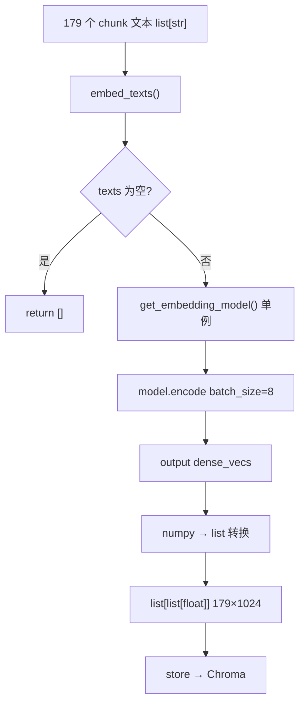

> **对照阅读：embedder.py 源码**
>
> | | |
> | --- | --- |
> | 仓库内路径 | `rag-backend/app/ingestion/embedder.py` |
> | GitHub 原文 | [打开 embedder.py（main 分支）](https://github.com/123XH-sudo/123xh-sudo.github.io/blob/main/rag-backend/app/ingestion/embedder.py) |
> | 上一篇 | [逐行解读 chunker.py]() |
> | 系列 | [loader.py]() → chunker → **embedder** |
>
> 全文 47 行，是 ingestion 里最短的一篇。文中穿插**读代码时的真实疑问与想通后的理解**。

## 1. embedder 在流水线中的位置

```
loader  →  chunker  →  embedder  →  store (Chroma)
                         ↑
                      本文
```

[`chunker.py`](https://github.com/123XH-sudo/123xh-sudo.github.io/blob/main/rag-backend/app/ingestion/chunker.py) 输出 179 个 `ChunkRecord`（文本小块），[`embedder.py`](https://github.com/123XH-sudo/123xh-sudo.github.io/blob/main/rag-backend/app/ingestion/embedder.py) 把每个 chunk 的 **文本变成 1024 维数字向量**，交给 `store.py` 写入 Chroma。

[`pipeline.py`](https://github.com/123XH-sudo/123xh-sudo.github.io/blob/main/rag-backend/app/ingestion/pipeline.py) 调用：

```python
texts = [c.content for c in chunks]
embeddings = embed_texts(texts)
upsert_chunks(collection, chunks, embeddings)
```

## 2. 学习背景：chunker 啃完，这篇反而轻松

读完 [chunker 那篇]() 后，`embedder.py` 只有 **47 行**，心理负担小很多。但概念上是新的一关——之前处理的都是「字符串怎么切」，这里变成「字符串怎么变成一串数字」。

**第一遍读时的核心困惑：**

1. 这一步算相似度检索还是语义检索？检索到底什么时候发生？
2. 「单例加载、批量向量化」——是只加载一次模型，但全部文章都要向量化吗？
3. `batch_size=8` 的 8 是哪来的？
4. `list[list[float]]` 二维列表怎么排？1024 和 float 什么关系？
5. 第 45–46 行：`dense_vecs`、`v`、`hasattr`、`tolist` 每个词什么意思？

这篇笔记按「先建立整体图景 → 再抠细节」的顺序整理。

## 3. 语义检索 vs 相似度：embedder 在整件事的哪一环？

这是我问得最抽象、也最重要的问题。

| 概念 | 含义 |
| --- | --- |
| **语义检索** | 按「意思像不像」找内容，不是关键词精确匹配 |
| **相似度** | 两个向量算出来的分数（如余弦相似度），越高越像 |

**embedder 做的**：把文本编码成语义向量——意思已经「压进」1024 个数字里了。  
**真正检索**：在 **Phase 3**，用户提问时，问题也 embed 成向量，Chroma 算「问题向量 vs 库内向量」的相似度，返回最相关的 chunk。

```
入库阶段（现在）  chunk 文本 → embed → 向量存进 Chroma
检索阶段（Phase 3）  用户问题 → embed → 和库内向量比相似度 → 返回 top-K
```

**思考：** 以前我把「向量化」和「检索」混为一谈。想通之后——embedder 是**为语义检索做准备**，不是检索本身。

## 4. 模块文档：单例 + 批量

→ 源码 [第 1–6 行](https://github.com/123XH-sudo/123xh-sudo.github.io/blob/main/rag-backend/app/ingestion/embedder.py#L1-L6)

### 「单例加载」= 模型只读进内存一次

索引 13 篇文章、179 个 chunk 时：

```python
get_embedding_model()  # 第 1 次：加载 BGE-M3，约 10–20s
get_embedding_model()  # 第 2～N 次：用缓存，几乎 0s
```

**不是**只向量化一篇文章，而是**模型文件只加载一次**，后面所有 chunk 共用同一个模型对象。

### 「批量向量化」= 一次函数调用处理很多条文本

```python
embed_texts([文本1, 文本2, ..., 文本179])  # 返回 179 个向量
```

**合在一起理解：** 单例解决「别重复加载模型」；批量解决「别一条一条调函数」。179 个 chunk 在一次 `embed_texts` 调用里处理完（内部分批见下节）。

## 5. 清代理：本地模型的坑

→ 源码 [第 14–24 行](https://github.com/123XH-sudo/123xh-sudo.github.io/blob/main/rag-backend/app/ingestion/embedder.py#L14-L24)

本地 BGE-M3 在 `./data/models/...`，不需要联网。若环境变量里设了 SOCKS 代理（`ALL_PROXY` 等），FlagEmbedding 可能误走代理而失败——Phase 1 踩过这个坑。

```python
def _clear_proxy_for_local_model():
    if settings.embedding_is_local:
        for key in _PROXY_KEYS:
            os.environ.pop(key, None)
```

只在 `embedding_is_local` 为真时清掉 6 个常见代理变量名。属于工程细节，理解「本地模型别走代理」即可。

## 6. get_embedding_model：@lru_cache 单例

→ 源码 [第 27–32 行](https://github.com/123XH-sudo/123xh-sudo.github.io/blob/main/rag-backend/app/ingestion/embedder.py#L27-L32)

```python
@lru_cache(maxsize=1)
def get_embedding_model():
    _clear_proxy_for_local_model()
    from FlagEmbedding import BGEM3FlagModel
    return BGEM3FlagModel(settings.embedding_model_path, use_fp16=False)
```

| 点 | 说明 |
| --- | --- |
| `@lru_cache(maxsize=1)` | 装饰器：函数返回值缓存，第 2 次起直接返回缓存 |
| 延迟 `import` | `FlagEmbedding` 在函数里 import，避免启动时就拉重量级库 |
| `use_fp16=False` | CPU 上不用半精度，更稳 |

**思考：** 第一次见 `@lru_cache` 装饰器，比 chunker 的嵌套函数简单——只要知道「同一个函数多次调用，只有第一次真干活」。

## 7. embed_texts 主流程

→ 源码 [第 35–46 行](https://github.com/123XH-sudo/123xh-sudo.github.io/blob/main/rag-backend/app/ingestion/embedder.py#L35-L46)

```python
def embed_texts(texts: list[str], batch_size: int = 8) -> list[list[float]]:
    if not texts:
        return []
    model = get_embedding_model()
    output = model.encode(texts, batch_size=batch_size, max_length=512)
    vectors = output["dense_vecs"]
    return [v.tolist() if hasattr(v, "tolist") else list(v) for v in vectors]
```

### batch_size=8 哪来的？

**经验默认值**，不是 BGE-M3 规定的。179 条文本不会一次全塞进 CPU，而是 **8 条一批** 送进 `model.encode`：

```
批 1：chunk 1～8
批 2：chunk 9～16
...
```

调大可能更快但占内存；8 在 CPU 上比较稳，以后可在配置里改。

### 二维 list 怎么排？

```python
embeddings[i]  ←→  texts[i]   # 下标一一对应
len(embeddings[i]) == 1024    # 每个向量 1024 个数
```

**1024 不是 float 的默认值**，而是 BGE-M3 dense 向量的**维度**；每个数字的类型是 `float`。

```
        维0    维1    维2   ...  维1023
texts[0]  →  [0.12, -0.03, 0.88, ..., 0.01]
texts[1]  →  [0.05,  0.22, -0.11, ..., 0.33]
...
```

### model.encode() 是什么？

`BGEM3FlagModel` 对象的方法，**FlagEmbedding 库提供的「文本 → 向量」接口**，不是 Python 内置函数。返回 dict，里面有多种类型的向量；咱们只用 **`dense_vecs`**（稠密向量）。

## 8. 第 45–46 行：我卡最久的地方

→ 源码 [第 45–46 行](https://github.com/123XH-sudo/123xh-sudo.github.io/blob/main/rag-backend/app/ingestion/embedder.py#L45-L46)

```python
vectors = output["dense_vecs"]
return [v.tolist() if hasattr(v, "tolist") else list(v) for v in vectors]
```

### 逐词理解

| 词 | 含义 |
| --- | --- |
| `output` | `model.encode()` 返回的字典 |
| `["dense_vecs"]` | 取出 dense 向量列表 |
| `vectors` | 多个 chunk 的向量组成的 list |
| `for v in vectors` | `v` = 某一个 chunk 的向量（长度 1024） |
| `hasattr(v, "tolist")` | 问：`v` 有没有 `.tolist` 方法？ |
| `v.tolist()` | 把 **numpy 数组** 转成 **Python list** |
| `else list(v)` | 若已是 list，包一层保底 |

### 为什么要 hasattr？

模型返回的 `v` **常常是 numpy 数组**，Chroma 要的是 **Python list**。两者看起来都是「1024 个数」，类型不同：

```python
import numpy as np
v = np.array([0.1, 0.2, 0.3])
type(v)           # numpy.ndarray  → 有 .tolist()
type(v.tolist())  # list           → Chroma 要的
```

若 `v` 已经是 list，没有 `.tolist()`，写死 `v.tolist()` 会报错。所以先 `hasattr` 判断，**两种类型都能转**。

**思考：** 这行是我问「为什么要问 v 有没有 tolist」的根源。想通后记一句话——**类型可能两种，先判断再转换，避免报错。** numpy 是 AI 里常用的数值数组库，和 Python 的 `list` 不是同一个东西。

## 9. 完整数据流



## 10. 验证

```python
from app.ingestion.embedder import embed_texts

texts = ["RAG 是检索增强生成", "向量数据库用于相似度搜索"]
vecs = embed_texts(texts)

print(len(vecs), len(vecs[0]))   # 2  1024
print(type(vecs[0]))             # list
```

第一次会等模型加载；第二次同一进程内再调会快很多——单例生效。

## 11. ingestion 系列进度

| 文件 | 状态 | 个人感受 |
| --- | --- | --- |
| [loader.py]() | ✅ | Python 语法卡点多，补了 5 课 |
| [chunker.py]() | ✅ | 最难，正则 + 分块策略 + restored 还原 |
| **embedder.py** | ✅ **本文** | 行数少，概念新（向量、单例、numpy） |
| store.py | 待读 | 写入 Chroma |
| pipeline.py | 待读 | 总调度 |

## 12. 小结

[`embedder.py`](https://github.com/123XH-sudo/123xh-sudo.github.io/blob/main/rag-backend/app/ingestion/embedder.py) 就做一件事：

> **单例加载 BGE-M3 → 批量把 chunk 文本 encode 成 1024 维向量 → 转成 Python list 交给 store。**

**这次读码收获：**

1. **语义检索 ≠ 在这一步发生** — embedder 是编码；检索在 Phase 3 用相似度算
2. **单例 + 批量** — 模型加载 1 次，179 条文本一次函数调用处理（内部分批 8 条）
3. **二维 list** — `embeddings[i]` 对应 `texts[i]`，内层 1024 个 float
4. **hasattr + tolist** — numpy 数组和 Python list 的桥梁，为 Chroma 准备

下一篇 **[store.py](https://github.com/123XH-sudo/123xh-sudo.github.io/blob/main/rag-backend/app/ingestion/store.py)**：向量 + metadata 怎么写进 Chroma，以及增量更新怎么删旧 chunk。
