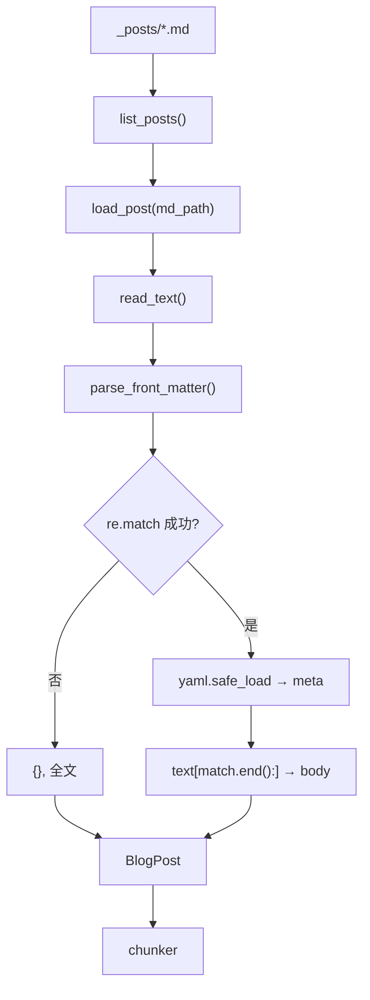

> **对照阅读：loader.py 源码**
>
> | | |
> | --- | --- |
> | 仓库内路径 | `rag-backend/app/ingestion/loader.py` |
> | GitHub 原文 | [打开 loader.py（main 分支）](https://github.com/123XH-sudo/123xh-sudo.github.io/blob/main/rag-backend/app/ingestion/loader.py) |
> | 本地 clone 后 | 用编辑器打开上述路径，与本文并排对照 |
>
> 下文按源码结构解读，每节附**行号链接**，点击可跳到 GitHub 对应位置。

## 1. loader 在流水线中的位置

个人博客 RAG 的 Phase 2 数据入库流水线：

```
_posts/*.md  →  loader  →  chunker  →  embedder  →  store (Chroma)
```

[`loader.py`](https://github.com/123XH-sudo/123xh-sudo.github.io/blob/main/rag-backend/app/ingestion/loader.py) 是第一步：**读 Markdown 文件，拆出元数据和正文，组装成结构化对象**，交给后面的切块和向量化。

不到 90 行，三个函数 + 一个数据类。建议左边开博客、右边开 [GitHub 源码](https://github.com/123XH-sudo/123xh-sudo.github.io/blob/main/rag-backend/app/ingestion/loader.py) 对照看。

## 2. 为什么不整篇 .md 直接入库？

Jekyll 文章开头有一段 YAML 配置（front matter）：

```markdown
---
layout: single
title: "RAG 系统基础"
date: 2026-08-06 00:00:00 +0800
tags: [RAG, LLM]
---
## 正文从这里开始
...
```

- `layout`、`permalink` 等是**站点配置**，不是正文，整篇入库会污染检索（用户搜 "RAG" 可能匹配到 `layout: single`）。
- `title`、`tags`、`date` 是有价值的，应作为 **metadata** 存入 Chroma，用于过滤和溯源。

loader 的职责：**剥离 front matter，元数据进 metadata，纯正文交给 chunker**。

模块顶部的设计说明见源码 [第 1–21 行](https://github.com/123XH-sudo/123xh-sudo.github.io/blob/main/rag-backend/app/ingestion/loader.py#L1-L21)。

## 3. BlogPost：输出数据结构

→ 源码 [第 31–40 行](https://github.com/123XH-sudo/123xh-sudo.github.io/blob/main/rag-backend/app/ingestion/loader.py#L31-L40)

```python
@dataclass
class BlogPost:
    source_file: str       # 文件名，如 "2026-08-06-RAG.md"
    post_title: str        # front matter 的 title
    post_date: str         # front matter 的 date
    post_tags: list[str]   # 标签列表
    body: str              # 去掉 front matter 后的 Markdown 正文
    path: Path             # 源文件完整路径
```

`@dataclass` 自动生成构造函数，下游 chunker 通过 `post.body` 切块，store 通过 `post.post_title`、`post.source_file` 等写入 metadata。

`source_file` 还是增量索引时的删除键——更新某篇文章时，先按文件名删掉旧 chunk，再写入新的。

## 4. parse_front_matter：拆 YAML 头与正文

→ 源码 [第 43–57 行](https://github.com/123XH-sudo/123xh-sudo.github.io/blob/main/rag-backend/app/ingestion/loader.py#L43-L57)

```python
def parse_front_matter(text: str) -> tuple[dict, str]:
    match = re.match(r"^---\s*\n(.*?)\n---\s*\n", text, re.DOTALL)
    if not match:
        return {}, text
    metadata = yaml.safe_load(match.group(1)) or {}
    return metadata, text[match.end():]
```

### 4.1 正则：匹配 front matter 块

→ 源码 [第 50 行](https://github.com/123XH-sudo/123xh-sudo.github.io/blob/main/rag-backend/app/ingestion/loader.py#L50)

```
^---\s*\n(.*?)\n---\s*\n
```

| 部分 | 含义 |
| --- | --- |
| `^---` | 文章开头是 `---` |
| `\s*\n` | 可选空白 + 换行 |
| `(.*?)` | **捕获组**：中间的 YAML 内容（非贪婪） |
| `\n---\s*\n` | 第二个 `---` 结束 front matter |

`re.DOTALL` 让 `.` 也能匹配换行，否则 `(.*?)` 只能捕获一行 YAML。

`re.match` 从字符串**开头**匹配。成功返回 `Match` 对象，失败返回 `None`。

### 4.2 没匹配到：没有 front matter

→ 源码 [第 51–52 行](https://github.com/123XH-sudo/123xh-sudo.github.io/blob/main/rag-backend/app/ingestion/loader.py#L51-L52)

```python
if not match:
    return {}, text
```

`match` 是 `None` 时 `if not match` 成立。返回空 dict + 原文全文，整篇当作正文处理。

### 4.3 解析 YAML

→ 源码 [第 55 行](https://github.com/123XH-sudo/123xh-sudo.github.io/blob/main/rag-backend/app/ingestion/loader.py#L55)

```python
metadata = yaml.safe_load(match.group(1)) or {}
```

- `match.group(1)` — 取出第一个捕获组，即两个 `---` 之间的 YAML 文本。
- `yaml.safe_load` — 解析 YAML 为 Python dict，例如 `{"title": "RAG 系统基础", "tags": ["RAG", "LLM"]}`。
- `or {}` — 解析结果为空或 `None` 时兜底为空 dict，避免后续 `.get()` 报错。

### 4.4 取正文

→ 源码 [第 57 行](https://github.com/123XH-sudo/123xh-sudo.github.io/blob/main/rag-backend/app/ingestion/loader.py#L57)

```python
return metadata, text[match.end():]
```

`match.end()` 是匹配结束位置的下标（第二个 `---` 之后）。`text[match.end():]` 切片取剩余部分，即 Markdown 正文。

`return metadata, body` 实际返回 `(metadata, body)` 元组，调用方一行拆包：

```python
meta, body = parse_front_matter(raw)
```

## 5. load_post：读文件并组装 BlogPost

→ 源码 [第 60–77 行](https://github.com/123XH-sudo/123xh-sudo.github.io/blob/main/rag-backend/app/ingestion/loader.py#L60-L77)

```python
def load_post(md_path: Path) -> BlogPost:
    raw = md_path.read_text(encoding="utf-8")
    meta, body = parse_front_matter(raw)

    tags = meta.get("tags") or []
    if isinstance(tags, str):
        tags = [tags]

    return BlogPost(
        source_file=md_path.name,
        post_title=str(meta.get("title", "未知标题")),
        post_date=str(meta.get("date", "")),
        post_tags=[str(t) for t in tags],
        body=body.strip(),
        path=md_path,
    )
```

逐段说明：

**读文件** — [第 62 行](https://github.com/123XH-sudo/123xh-sudo.github.io/blob/main/rag-backend/app/ingestion/loader.py#L62)

```python
raw = md_path.read_text(encoding="utf-8")
```

`Path` 对象直接读文本。`md_path.name` 是文件名（不含目录），`md_path` 本身是完整路径。

**拆 front matter** — [第 63 行](https://github.com/123XH-sudo/123xh-sudo.github.io/blob/main/rag-backend/app/ingestion/loader.py#L63)

```python
meta, body = parse_front_matter(raw)
```

上一节的函数，得到 metadata dict 和正文字符串。

**处理 tags** — [第 66–68 行](https://github.com/123XH-sudo/123xh-sudo.github.io/blob/main/rag-backend/app/ingestion/loader.py#L66-L68)

Jekyll 里 tags 有两种写法：

```yaml
tags: [RAG, LLM]    # 列表
tags: RAG           # 单个字符串
```

```python
tags = meta.get("tags") or []     # 没有 tags 键 → 空列表
if isinstance(tags, str):
    tags = [tags]                 # 单个字符串 → 包成列表
```

如果对字符串 `"RAG"` 直接 `[str(t) for t in tags]`，会逐字符迭代得到 `['R', 'A', 'G']`，所以必须先判断。

**组装 BlogPost** — [第 70–77 行](https://github.com/123XH-sudo/123xh-sudo.github.io/blob/main/rag-backend/app/ingestion/loader.py#L70-L77)

```python
post_title=str(meta.get("title", "未知标题"))   # .get 键不存在时用默认值
post_date=str(meta.get("date", ""))             # 统一转 str，Chroma metadata 要求
post_tags=[str(t) for t in tags]                # 每个 tag 转 str
body=body.strip()                               # 去掉首尾空白
```

## 6. list_posts：扫描目录

→ 源码 [第 80–86 行](https://github.com/123XH-sudo/123xh-sudo.github.io/blob/main/rag-backend/app/ingestion/loader.py#L80-L86)

```python
def list_posts(posts_dir: Path) -> list[Path]:
    return sorted(posts_dir.glob("*.md"))
```

- `glob("*.md")` — 匹配当前目录下所有 `.md` 文件，不递归子目录。
- `sorted(...)` — 按文件名排序。文件名以日期开头（`2026-08-06-...`），排序后大致等于时间顺序。

pipeline 里先调它拿文件列表，再对每个路径调 `load_post`（见 [`pipeline.py`](https://github.com/123XH-sudo/123xh-sudo.github.io/blob/main/rag-backend/app/ingestion/pipeline.py)）：

```python
files = list_posts(posts_dir)
for md_path in files:
    post = load_post(md_path)
    # → chunker → embedder → store
```

## 7. 完整数据流



## 8. 验证

在 `rag-backend/` 目录下：

```python
from pathlib import Path
from app.ingestion.loader import load_post, list_posts

files = list_posts(Path("../_posts"))
print(f"共 {len(files)} 篇")

post = load_post(files[0])
print(post.post_title)
print(post.post_tags)
print(post.body[:200])
```

## 9. 附录：读 loader 之前补的 Python 语法

正则本身能看懂，卡住的是 Python 语法。针对性地补了前 5 个知识点，练习脚本：

→ [`rag-backend/scripts/python_basics_for_loader.py`](https://github.com/123XH-sudo/123xh-sudo.github.io/blob/main/rag-backend/scripts/python_basics_for_loader.py)

| 知识点 | loader 中的体现 |
| --- | --- |
| 字符串切片 `text[i:]` | `text[match.end():]` |
| `.strip()` | `body.strip()` |
| dict 与 `.get(key, default)` | `meta.get("title", "未知标题")` |
| 元组返回与拆包 | `return metadata, body` → `meta, body = ...` |
| `None`、`if not`、`or` | `if not match:`、`... or {}`、`... or []` |
| 列表推导 | `[str(t) for t in tags]` |

用法：`python scripts/python_basics_for_loader.py --lesson 1`（1–5 课各跑一遍）。

## 10. 小结

[`loader.py`](https://github.com/123XH-sudo/123xh-sudo.github.io/blob/main/rag-backend/app/ingestion/loader.py) 逻辑不复杂：**正则定位 front matter → YAML 解析元数据 → 切片取正文 → 归一化 tags → 组装 BlogPost**。难点不在 RAG，在于 Python 特有的写法（拆包、`or` 兜底、列表推导）。

下一步是 **chunker.py**——把 `post.body` 按标题切成合适大小的 chunk。
