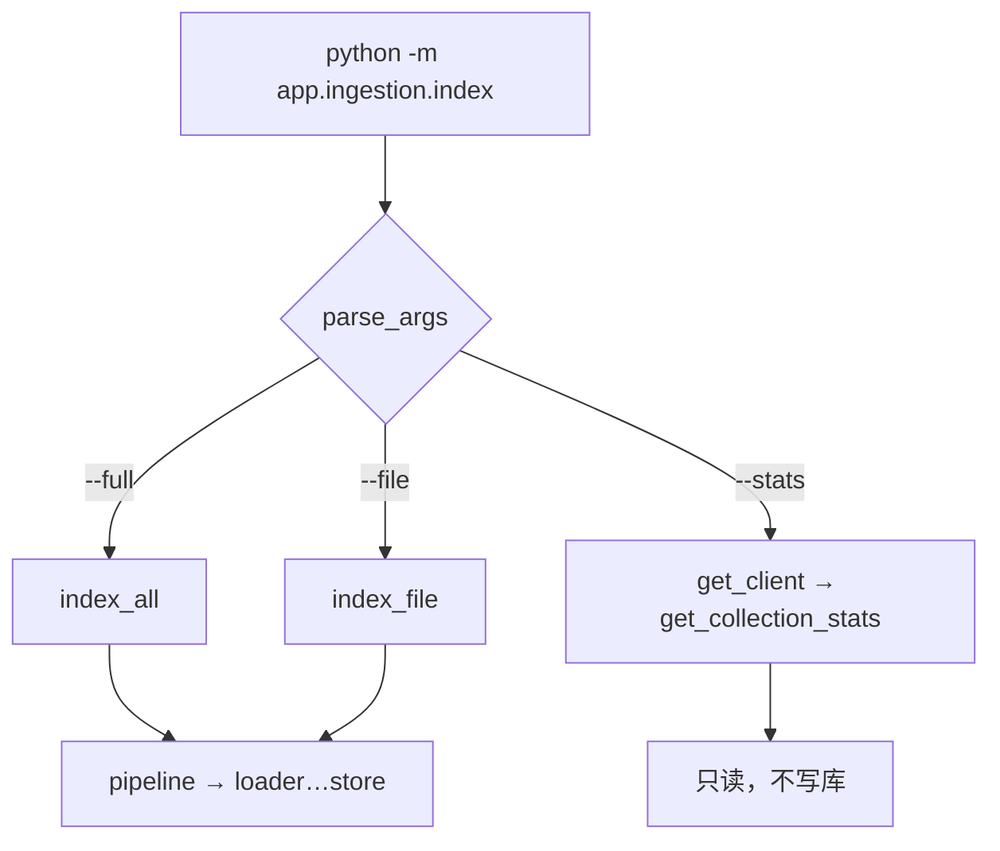

> **对照阅读：index.py 源码**
>
> | | |
> | --- | --- |
> | 仓库内路径 | `rag-backend/app/ingestion/index.py` |
> | GitHub 原文 | [打开 index.py（main 分支）](https://github.com/123XH-sudo/123xh-sudo.github.io/blob/main/rag-backend/app/ingestion/index.py) |
> | 上一篇 | [逐行解读 pipeline.py]() |
> | 系列 | [loader]() → [chunker]() → [embedder]() → [store]() → [pipeline]() → **index** |
>
> 全文 49 行。Phase 2 ingestion **最后一篇**——你在终端敲的命令，从这里进来。不含 load / chunk / embed 业务逻辑，只做「解析参数 → 调函数」。

## 1. index 在整体架构中的位置

```
终端命令（你敲的）
    ↓
index.py       ← 本文：CLI 入口
    ↓
pipeline.py    （--full / --file）
或 store        （--stats，只读）
    ↓
loader → chunker → embedder → store → Chroma
```

[pipeline 篇]()里说过 index 是「接线员」。读完 loader 到 pipeline 六篇后，我最后补读 index，主要想弄清：**三个命令分别调谁、`argparse` 怎么写、出错时程序怎么退出**。

## 2. 读之前的主要困惑

1. `python -m app.ingestion.index` 里的 `-m` 是什么意思？
2. `mutually_exclusive_group` 是什么？为什么不能 `--full` 和 `--file` 一起用？
3. `--stats` 会走 pipeline 吗？会不会误触发 embed？
4. 业务逻辑到底在哪一层？index 里为什么几乎全是 `if/elif`？

下面按行号对照源码。

## 3. 第 1 行：Shebang

→ 源码 [第 1 行](https://github.com/123XH-sudo/123xh-sudo.github.io/blob/main/rag-backend/app/ingestion/index.py#L1)

```python
#!/usr/bin/env python3
```

告诉 Linux/macOS：**用系统的 `python3` 运行这个文件**。也可以直接：

```bash
python -m app.ingestion.index --stats
```

日常更常用 `-m` 方式，不依赖 shebang；shebang 是为了 `./index.py` 这种直接执行准备的。

## 4. 第 2–9 行：模块文档（用法速查）

→ 源码 [第 2–9 行](https://github.com/123XH-sudo/123xh-sudo.github.io/blob/main/rag-backend/app/ingestion/index.py#L2-L9)

三个命令对应后面三个分支：

| 命令 | 作用 |
| --- | --- |
| `--full` | 全量索引 `_posts/` |
| `--file NAME` | 增量更新单篇 |
| `--stats` | 查看库内 chunk 数量 |

**注意：** 必须在 `rag-backend/` 目录下运行，否则 `from app.config import ...` 会找不到包。

## 5. 第 10 行：`from __future__ import annotations`

和 loader / pipeline 一样，项目统一写法，这里几乎没直接用到类型注解，可略过。

## 6. 第 12–17 行：导入

→ 源码 [第 12–17 行](https://github.com/123XH-sudo/123xh-sudo.github.io/blob/main/rag-backend/app/ingestion/index.py#L12-L17)

```python
import argparse
import sys

from app.config import settings
from app.ingestion.pipeline import index_all, index_file
from app.ingestion.store import get_client, get_collection_stats, get_or_create_collection
```

| 导入 | 用途 |
| --- | --- |
| `argparse` | 解析 `--full` / `--file` / `--stats` |
| `sys` | 出错时 `sys.exit(1)` |
| `settings` | 打印博客目录、Chroma 路径、模型路径 |
| `index_all`, `index_file` | `--full` / `--file` 调 [pipeline]() |
| store 三个函数 | 仅 `--stats` 用，**不经过 pipeline** |

**思考：** 49 行里，真正「干活」的全是 import 进来的函数；index 自己只做分发。

## 7. 第 20–26 行：定义命令行参数

→ 源码 [第 20–26 行](https://github.com/123XH-sudo/123xh-sudo.github.io/blob/main/rag-backend/app/ingestion/index.py#L20-L26)

### 7.1 创建解析器

```python
parser = argparse.ArgumentParser(description="博客知识库索引（阶段 2）")
```

`ArgumentParser` = Python 标准库里的**命令行参数解析器**。`description` 会在 `--help` 时显示。

### 7.2 互斥组（重点）

```python
group = parser.add_mutually_exclusive_group(required=True)
```

| 部分 | 含义 |
| --- | --- |
| `mutually_exclusive_group` | 组内参数**三选一**，不能同时传 |
| `required=True` | **必须**带其中一个，不能空跑 |

合法示例：

```bash
python -m app.ingestion.index --full
python -m app.ingestion.index --file 2026-08-06-RAG.md
python -m app.ingestion.index --stats
```

非法示例：

```bash
python -m app.ingestion.index                    # 缺参数 → argparse 报错
python -m app.ingestion.index --full --file x.md # 冲突 → argparse 报错
```

**为什么互斥？** `--full` 是清空重建，`--file` 是增量单篇，同时传语义冲突；互斥组在解析阶段就拦住，比进 pipeline 再报错更清晰。

### 7.3 三个参数

```python
group.add_argument("--full", action="store_true", help="...")
group.add_argument("--file", metavar="NAME", help="...")
group.add_argument("--stats", action="store_true", help="...")
```

| 参数 | 类型 | 解析后 `args` |
| --- | --- | --- |
| `--full` | `action="store_true"` | `args.full == True`（没写则为 `False`） |
| `--file NAME` | 需要跟字符串 | `args.file == "2026-08-06-RAG.md"` |
| `--stats` | `store_true` | `args.stats == True` |

`metavar="NAME"`：帮助文档里显示 `--file NAME`，提示用户要跟文件名。

### 7.4 解析

```python
args = parser.parse_args()
```

读取 `sys.argv`（终端传入的参数列表），填进 `args` 对象。之后用 `args.full`、`args.file`、`args.stats` 分支。

## 8. 第 28–30 行：打印当前配置

→ 源码 [第 28–30 行](https://github.com/123XH-sudo/123xh-sudo.github.io/blob/main/rag-backend/app/ingestion/index.py#L28-L30)

```python
print(f"博客目录: {settings.posts_path}")
print(f"Chroma: {settings.chroma_path} / {settings.chroma_collection}")
print(f"Embedding: {settings.embedding_model_path}\n")
```

**不管走哪条分支，先打印环境**，方便确认读哪个目录、向量库在哪、用哪个 embedding 模型。末尾 `\n` 空一行，和后续输出分开。

## 9. 第 32–41 行：三条分支 — 核心逻辑

→ 源码 [第 32–41 行](https://github.com/123XH-sudo/123xh-sudo.github.io/blob/main/rag-backend/app/ingestion/index.py#L32-L41)

```python
try:
    if args.full:
        index_all()
    elif args.file:
        index_file(args.file)
    elif args.stats:
        client = get_client()
        collection = get_or_create_collection(client)
        stats = get_collection_stats(collection)
        print(f"✅ 库内 chunk 总数: {stats['total_chunks']}")
```

### 分支 1：`--full` → `index_all()`

全量重建，见 [pipeline 篇 §6]()。`index_all()` 内部会 print 进度；这里**没有接住返回值**（和 pipeline 篇里讲的一样）。

### 分支 2：`--file` → `index_file(args.file)`

增量索引单篇。`args.file` 就是 `--file` 后面跟的文件名。**日常改一篇 / 新写一篇博客用这个。**

### 分支 3：`--stats` — 只读，不写库

| 步骤 | 函数 | 作用 |
| --- | --- | --- |
| 1 | `get_client()` | 连 Chroma |
| 2 | `get_or_create_collection(client)` | 打开 `blog_chunks` |
| 3 | `get_collection_stats(collection)` | 统计 chunk 总数 |
| 4 | print | 打印结果 |

**不调用 pipeline**，不 load、不 chunk、不 embed、不 upsert。适合快速看「库里现在有多少 chunk」。

### 三条路径对照

| 命令 | 调用 | 会写库吗 |
| --- | --- | --- |
| `--full` | `index_all()` | ✅ 先清空再全写 |
| `--file xxx.md` | `index_file(...)` | ✅ 增量写一篇 |
| `--stats` | store 三个函数 | ❌ 只读 |



## 10. 第 42–44 行：异常处理

→ 源码 [第 42–44 行](https://github.com/123XH-sudo/123xh-sudo.github.io/blob/main/rag-backend/app/ingestion/index.py#L42-L44)

```python
except Exception as e:
    print(f"❌ 索引失败: {e}", file=sys.stderr)
    sys.exit(1)
```

| 部分 | 含义 |
| --- | --- |
| `except Exception as e` | 捕获任意异常（文件不存在、Chroma 失败等） |
| `file=sys.stderr` | 错误输出到标准错误流（终端里常显示为红色） |
| `sys.exit(1)` | 非 0 退出码，脚本 / CI 能识别失败 |

例如文章不存在时，pipeline 抛 `FileNotFoundError`，这里统一打印 `❌ 索引失败: 文章不存在: ...`，而不是一长串 traceback（除非 Python 调试模式）。

## 11. 第 47–48 行：程序入口

→ 源码 [第 47–48 行](https://github.com/123XH-sudo/123xh-sudo.github.io/blob/main/rag-backend/app/ingestion/index.py#L47-L48)

```python
if __name__ == "__main__":
    main()
```

| 运行方式 | 行为 |
| --- | --- |
| `python -m app.ingestion.index` | `__name__ == "__main__"` → 执行 `main()` |
| 别的文件 `import` 本模块 | **不会**自动跑 `main()` |

Python CLI 脚本的标准写法。

## 12. 新语法/概念小结

| 语法 | 在哪 | 含义 |
| --- | --- | --- |
| `argparse.ArgumentParser` | 21 行 | 命令行解析 |
| `mutually_exclusive_group` | 22 行 | 参数三选一 |
| `action="store_true"` | 23、25 行 | 有 flag 即为 True |
| `args.file` | 36 行 | 用户传入的文件名 |
| `try / except` | 32–44 行 | 统一错误处理 |
| `sys.exit(1)` | 44 行 | 失败退出 |
| `if __name__ == "__main__"` | 47 行 | 仅直接运行时执行 |

## 13. 自测题

| 问题 | 答案 |
| --- | --- |
| 改一篇博客敲什么？ | `python -m app.ingestion.index --file 文件名.md` |
| `--stats` 会 embed 吗？ | 不会，只读统计 |
| 业务逻辑在哪？ | pipeline / store，不在 index |
| 为什么用互斥组？ | 防止 `--full` 和 `--file` 同时传 |

## 14. 验证

```bash
cd rag-backend && source .venv/bin/activate

python -m app.ingestion.index --stats
# ✅ 库内 chunk 总数: 179

python -m app.ingestion.index --help
# 查看 argparse 生成的帮助文档
```

## 15. ingestion 系列进度（完结）

| 文件 | 状态 |
| --- | --- |
| loader / chunker / embedder / store / pipeline | ✅ 已有博客 |
| **index.py** | ✅ **本文** |

**Phase 2 数据入库**代码带读至此全部完成。下一步 **Phase 3 检索**：`app/retrieval/vector_store.py`（待实现）——用户提问 → embed → Chroma 相似搜索 → 返回 top-K chunk。

## 16. 小结

[`index.py`](https://github.com/123XH-sudo/123xh-sudo.github.io/blob/main/rag-backend/app/ingestion/index.py) 做一件事：**把终端命令翻译成对 pipeline / store 的函数调用**。

**读码收获：**

1. **index 是 CLI 壳**，49 行里没有 load/chunk/embed 算法
2. **`argparse` 互斥组**保证 `--full` / `--file` / `--stats` 三选一
3. **`--stats` 只读**，不经过 pipeline，不会误写库
4. **`try/except` + `sys.exit(1)`** 统一失败出口
5. **日常 `--file`，重建 `--full`**——和 [store]() / [pipeline]() 篇的结论一致

Phase 3 第一篇待写：**向量检索 baseline**（`vector_store.py`）。
