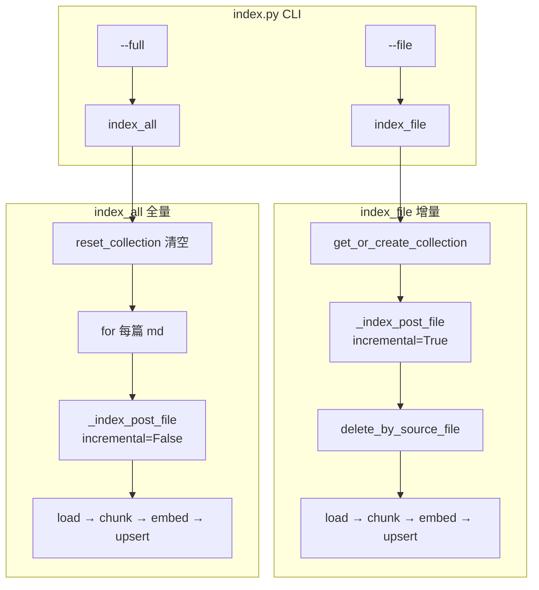

> **对照阅读：pipeline.py 源码**
>
> | | |
> | --- | --- |
> | 仓库内路径 | `rag-backend/app/ingestion/pipeline.py` |
> | GitHub 原文 | [打开 pipeline.py（main 分支）](https://github.com/123XH-sudo/123xh-sudo.github.io/blob/main/rag-backend/app/ingestion/pipeline.py) |
> | 上一篇 | [逐行解读 store.py]() |
> | 系列 | [loader]() → [chunker]() → [embedder]() → [store]() → **pipeline** |
> | CLI | [`index.py`](https://github.com/123XH-sudo/123xh-sudo.github.io/blob/main/rag-backend/app/ingestion/index.py) |
>
> 全文 95 行。前面四篇各管一步，**pipeline 是总指挥**——把 loader / chunker / embedder / store 串成 `--full` 和 `--file` 两条完整路径。文中穿插读码时的真实疑问。

## 1. pipeline 在整体架构中的位置

```
你敲的命令（CLI）
    ↓
index.py          ← 解析 --full / --file / --stats
    ↓
pipeline.py       ← 本文：编排整条流水线
    ↓
loader → chunker → embedder → store → Chroma
```

[loader]()、[chunker]()、[embedder]()、[store]() 四篇读完后，我的感受是：**算法都在子模块里，pipeline 本身没有新算法，只有「按什么顺序调用谁」**。读这篇的目标，是把 store 篇里「全量 / 增量两条路径」和具体代码行对上号。

## 2. 读之前的主要困惑

1. `incremental` 是 Python 关键词吗？一个单词怎么就能决定是不是增量？
2. `time.perf_counter()` 没见过——`elapsed` 到底量的是哪一段耗时？只算 chunk 切块吗？
3. 函数 `return { "files": ..., "chunks": ..., **stats }` 到底要返回什么？为什么？
4. 改一篇博客走哪条路径？delete 在哪一行？全量为什么不在循环里 delete？

下面按源码结构逐段解，最后一节用自测题收束。

## 3. 导入：四模块汇总

→ 源码 [第 4–20 行](https://github.com/123XH-sudo/123xh-sudo.github.io/blob/main/rag-backend/app/ingestion/pipeline.py#L4-L20)

```python
import time
from pathlib import Path

from app.config import settings
from app.ingestion.chunker import chunk_post
from app.ingestion.embedder import embed_texts
from app.ingestion.loader import load_post, list_posts
from app.ingestion.store import (
    delete_by_source_file,
    get_client,
    get_collection_stats,
    get_or_create_collection,
    reset_collection,
    upsert_chunks,
)
```

| 来源 | 导入 | 干什么 |
| --- | --- | --- |
| loader | `load_post`, `list_posts` | 读单篇、列 `_posts/` 下全部 md |
| chunker | `chunk_post` | 切块 |
| embedder | `embed_texts` | 向量化 |
| store | 6 个函数 | 连库、删旧、写入、统计 |
| config | `settings` | `chunk_size=512`、`posts_path` 等 |
| `time` | 计时 | 打印索引耗时 |

**思考：** 这一屏 import 就是 Phase 2 ingestion 的「零件清单」。pipeline 自己不处理文本，只负责**按顺序调这些函数**。

## 4. 核心：`_index_post_file` — 索引单篇文章

→ 源码 [第 23–41 行](https://github.com/123XH-sudo/123xh-sudo.github.io/blob/main/rag-backend/app/ingestion/pipeline.py#L23-L41)

### 4.1 函数签名

```python
def _index_post_file(md_path: Path, collection, *, incremental: bool) -> int:
```

| 部分 | 含义 |
| --- | --- |
| `_index_post_file` | 前缀 `_` = 内部函数，给 `index_file` / `index_all` 调用 |
| `md_path` | 一篇 `.md` 的路径 |
| `collection` | Chroma 的 collection 对象（store 拿到的） |
| `*, incremental` | `*` 后面必须**关键字传参**，如 `incremental=True` |
| `-> int` | 返回这篇写入了几个 chunk |

### 4.2 `incremental` 是什么？（FAQ）

**不是 Python 关键词，是作者自己起的参数名。**

可以改成 `is_incremental`、`do_delete_first`，效果一样——**就是一个布尔标志变量**：

| 值 | 行为 | 谁传入 |
| --- | --- | --- |
| `True` | 先 `delete_by_source_file` 删这篇旧 chunk | [`index_file` 第 55 行](https://github.com/123XH-sudo/123xh-sudo.github.io/blob/main/rag-backend/app/ingestion/pipeline.py#L55) |
| `False` | 不删（全量前已 `reset_collection` 清空） | [`index_all` 第 81 行](https://github.com/123XH-sudo/123xh-sudo.github.io/blob/main/rag-backend/app/ingestion/pipeline.py#L81) |

Python 不会「认识」`incremental` 这个词；只有下面这一行在用它：

```python
if incremental:
    delete_by_source_file(collection, post.source_file)
```

**结论：就是个判断标志，没有魔法。**

### 4.3 单篇数据流（五步）

```python
post = load_post(md_path)                    # ① loader
chunks = chunk_post(post, ...)               # ② chunker
if not chunks: return 0                      # 空文跳过
if incremental: delete_by_source_file(...)   # ③ 增量才删
texts = [c.content for c in chunks]
embeddings = embed_texts(texts)                # ④ embedder
upsert_chunks(collection, chunks, embeddings)  # ⑤ store
return len(chunks)
```

列表推导 `[c.content for c in chunks]`：embedder 只要正文字符串；`upsert_chunks` 仍用完整 `ChunkRecord`（含 metadata）。

**delete 真正执行的位置：** [第 35–36 行](https://github.com/123XH-sudo/123xh-sudo.github.io/blob/main/rag-backend/app/ingestion/pipeline.py#L35-L36)，不是第 55 行——第 55 行只是 `index_file` **传入** `incremental=True` 的「开关」。

## 5. `index_file` — 增量 `--file`

→ 源码 [第 44–61 行](https://github.com/123XH-sudo/123xh-sudo.github.io/blob/main/rag-backend/app/ingestion/pipeline.py#L44-L61)

**日常改一篇 / 新写一篇，都走这里。**

```python
md_path = settings.posts_path / filename
if not md_path.exists():
    raise FileNotFoundError(...)
```

`Path / "filename"` 拼接路径，如 `../_posts/2026-08-06-RAG.md`。文件不存在就抛异常，CLI 会打印 `❌ 索引失败`。

```python
t0 = time.perf_counter()
client = get_client()
collection = get_or_create_collection(client)   # 不清库

n = _index_post_file(md_path, collection, incremental=True)
elapsed = time.perf_counter() - t0
stats = get_collection_stats(collection)
```

### 5.1 `time.perf_counter()` 和 `elapsed`（FAQ）

`perf_counter()` 是标准库 `time` 里的**高精度计时函数**，单调递增，适合测「这段代码跑了多久」（比 `time.time()` 更适合性能测量）。

**`elapsed` 量的是哪一段？**

从 `t0 = time.perf_counter()` 到 `elapsed = time.perf_counter() - t0`，**整段都算**，包括：

1. 连接 Chroma（`get_client`）
2. 打开/创建 collection（`get_or_create_collection`）
3. 整篇 `_index_post_file`：load → chunk → delete → **embed（通常最慢）** → upsert

**不算进去：** 第 57 行之后的 `get_collection_stats`（在 `elapsed` 之后才算）。

所以 **`elapsed` 不是「只算 chunk 切块」**，而是 **「这次索引任务的主体耗时」**——改一篇时，基本就是读文件 + 切块 + 删旧 + 向量化 + 写入的总时间。

### 5.2 返回值（FAQ）

```python
return {"file": filename, "chunks": n, "elapsed_s": round(elapsed, 2), **stats}
```

| 字段 | 含义 |
| --- | --- |
| `"file"` | 处理了哪篇 |
| `"chunks"` | 这篇写入了几个 chunk |
| `"elapsed_s"` | 耗时（秒，保留 2 位小数） |
| `"total_chunks"` | 库里现在总共有多少 chunk（来自 `**stats` 展开） |

`**stats` 是字典解包：若 `stats = {"total_chunks": 179}`，展开后等价于手写 `"total_chunks": 179`。

**为什么要 return？** 终端里已有 `print`；return 是把同一份摘要**打包成 dict**，方便测试、脚本或以后 API 调用。当前 [`index.py`](https://github.com/123XH-sudo/123xh-sudo.github.io/blob/main/rag-backend/app/ingestion/index.py) 没有接住返回值（`index_file(args.file)` 直接调完就结束），但接口留着是合理设计。

## 6. `index_all` — 全量 `--full`

→ 源码 [第 64–94 行](https://github.com/123XH-sudo/123xh-sudo.github.io/blob/main/rag-backend/app/ingestion/pipeline.py#L64-L94)

**第一次建库 / 重建** 走这里。

```python
files = list_posts(posts_dir)           # loader：扫描 _posts/*.md
collection = reset_collection(client)   # store：清空整个 blog_chunks

for md_path in files:
    n = _index_post_file(md_path, collection, incremental=False)
    total_chunks += n
```

### 全量为什么不在循环里 delete？（FAQ）

因为 **第 76 行已经 `reset_collection` 把整个 collection 删空再建**了。循环里每篇都是往空库写，`incremental=False` 不再逐篇 delete——**重复 delete 既没必要，也浪费时间**。

全量返回：

```python
return {
    "files": len(files),
    "chunks": total_chunks,
    "elapsed_s": round(elapsed, 2),
    **stats,
}
```

和 `index_file` 字段略有不同（`files` / 总 `chunks` 而非单篇 `file`），结构一致。

## 7. 两条路径对照

| | **增量 `index_file`** | **全量 `index_all`** |
| --- | --- | --- |
| CLI | `--file xxx.md` | `--full` |
| 准备 collection | `get_or_create_collection` | `reset_collection`（清空） |
| 处理范围 | 1 篇 | 全部 `_posts/*.md` |
| `_index_post_file` | `incremental=True`（先 delete） | `incremental=False`（不 delete） |
| 典型场景 | 日常改/新写一篇 | 第一次建库、改分块策略后重建 |



## 8. 和 `index.py` 的关系（顺带一眼）

[`index.py`](https://github.com/123XH-sudo/123xh-sudo.github.io/blob/main/rag-backend/app/ingestion/index.py) 约 49 行，**只有 argparse，不含业务逻辑**：

```python
if args.full:
    index_all()
elif args.file:
    index_file(args.file)
elif args.stats:
    # 只读统计，不调 pipeline
```

你敲的命令 → `index.py` → **`pipeline.py`** → 四个子模块。`--stats` 不经过 pipeline，直接调 store 的 `get_collection_stats`。

## 9. 自测题（读完后应能答）

| 问题 | 答案 |
| --- | --- |
| 改一篇博客走哪条路径？ | `index_file`（CLI：`--file`） |
| delete 在哪一行、什么条件？ | [35–36 行](https://github.com/123XH-sudo/123xh-sudo.github.io/blob/main/rag-backend/app/ingestion/pipeline.py#L35-L36)，`incremental=True` 时 |
| 全量为什么不在循环里 delete？ | 已 `reset_collection` 全库清空，循环里再删多余 |
| `incremental` 是关键词吗？ | 否，自定义布尔参数 |
| `elapsed` 量什么？ | 连库 + 单篇/全库索引主体耗时，不是只算 chunk |

## 10. 验证

```bash
cd rag-backend && source .venv/bin/activate

# 增量：改一篇
python -m app.ingestion.index --file 2026-08-06-RAG.md
# 📄 增量索引: ...
#   └─ 写入 N 个 chunk, 耗时 X.Xs
# ✅ 库内总计 M 个 chunk

# 全量：重建（慎用，耗时长）
python -m app.ingestion.index --full
```

## 11. ingestion 系列进度

| 文件 | 状态 |
| --- | --- |
| loader / chunker / embedder / store | ✅ 已有博客 |
| **pipeline.py** | ✅ **本文** |
| [index.py]() | ✅ 已有博客 |

Phase 2 **数据入库**读码在 [index 篇]() 收束；下一步是 **Phase 3 检索**（query → embed → Chroma 相似搜索 → 拼 prompt）。

## 12. 小结

[`pipeline.py`](https://github.com/123XH-sudo/123xh-sudo.github.io/blob/main/rag-backend/app/ingestion/pipeline.py) 做一件事：**把 loader → chunker → embedder → store 按顺序串起来**，用 `incremental` 区分增量 / 全量。

**读码收获：**

1. **pipeline 没有新算法**，只有编排；前面四篇的函数名在这里全部汇合
2. **`incremental` 是标志变量**，不是语言魔法；delete 在 `_index_post_file` 第 35–36 行
3. **`elapsed` 是整次索引主体耗时**，embed 通常占大头
4. **`return dict` + `**stats`** 把结果交给调用方；CLI 目前主要靠 print
5. **日常 `--file`，重建 `--full`**；全量先 `reset_collection`，循环里不必再 delete
