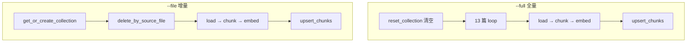

> **对照阅读：store.py 源码**
>
> | | |
> | --- | --- |
> | 仓库内路径 | `rag-backend/app/ingestion/store.py` |
> | GitHub 原文 | [打开 store.py（main 分支）](https://github.com/123XH-sudo/123xh-sudo.github.io/blob/main/rag-backend/app/ingestion/store.py) |
> | 上一篇 | [逐行解读 embedder.py]() |
> | 系列 | [loader]() → [chunker]() → [embedder]() → **store** |
> | CLI | [`index.py`](https://github.com/123XH-sudo/123xh-sudo.github.io/blob/main/rag-backend/app/ingestion/index.py) |
>
> 全文 72 行。文中穿插**读代码时的真实疑问**，尤其是 Chroma 是什么、全量/增量怎么用。

## 1. store 在流水线中的位置

```
loader  →  chunker  →  embedder  →  store  →  Chroma 磁盘
                                      ↑
                                   本文
```

前面三步产出 **chunk 文本 + 1024 维向量**，[`store.py`](https://github.com/123XH-sudo/123xh-sudo.github.io/blob/main/rag-backend/app/ingestion/store.py) 负责 **写入本地 Chroma**。Phase 3 检索时读的就是这个库。

[`pipeline.py`](https://github.com/123XH-sudo/123xh-sudo.github.io/blob/main/rag-backend/app/ingestion/pipeline.py) 最后一行：

```python
upsert_chunks(collection, chunks, embeddings)
```

## 2. 学习背景：Chroma 概念很抽象

embedder 读懂后，store 行数不多，但**概念换了一套**——不再是 Python 字符串和 list，而是「向量库」「collection」「upsert」。读第一遍时的主要困惑：

1. Chroma 到底是什么？数据存在哪？是文件还是服务？
2. 增量更新为什么要先删旧 chunk？不能直接往后加吗？
3. 全量 `--full` 什么时候用？日常改一篇博客呢？
4. 全新文章「新增」在哪个函数？和改旧文章有什么区别？
5. `get_or_create_collection` 像递归？`"hnsw:space": "cosine"` 怎么就等于余弦相似度了？
6. 六个函数各自干什么？之前扫一眼函数名完全对不上用途。

这篇按「先建立直觉 → 再对代码 → 再对 CLI」整理。

## 3. Chroma 是什么？存在哪里？

### 用 MySQL 类比

| 概念 | MySQL | 本项目 Chroma |
| --- | --- | --- |
| 存储位置 | `/var/lib/mysql/` | `rag-backend/data/chroma/` |
| 逻辑容器 | 数据库 | PersistentClient |
| 表 | `users` | collection **`blog_chunks`** |
| 一行 | 一条记录 | 一个 chunk（id + 文本 + 向量 + metadata） |

### 磁盘上长什么样

跑过全量索引后，`rag-backend/data/chroma/` 下会有：

```
chroma.sqlite3              ← 元数据（id、document、metadata）
xxxxxxxx-xxxx-.../          ← 向量索引（HNSW）
```

**思考：** 以前我误以为向量在 MySQL 或某个「云库」里。实际上是 **Python 库 + 本地文件夹**，和 SQLite 文件类似，程序关了这个目录还在。

### 一条 chunk 在库里的结构

```
id:         "2026-08-06-RAG_chunk_003"
document:   "【RAG 系统基础 > 原理】\nRAG 是..."
embedding:  [0.12, -0.03, ..., 1024 个数]
metadata:   {source_file, post_title, post_tags, section_title, ...}
```

## 4. 六个函数是干什么的？（先记这张表）

| 函数 | 一句话 | 谁调用 |
| --- | --- | --- |
| `get_client` | 打开本地 Chroma（文件夹） | pipeline |
| `get_or_create_collection` | 拿到名为 `blog_chunks` 的 collection | pipeline |
| `delete_by_source_file` | 删掉**某一篇文章**的所有旧 chunk | 增量 `--file` |
| `reset_collection` | **全量前**删掉整个 collection 再建空的 | `--full` |
| **`upsert_chunks`** | **真正写库**：文本 + 向量 + metadata | 每次索引 |
| `get_collection_stats` | 统计 chunk 总数 | `--stats`、索引完成打印 |

**核心只有 `upsert_chunks`。** 其它函数都是连库、拿表、删旧、统计。

## 5. get_client：连库 + 建目录

→ 源码 [第 17–19 行](https://github.com/123XH-sudo/123xh-sudo.github.io/blob/main/rag-backend/app/ingestion/store.py#L17-L19)

```python
def get_client() -> chromadb.PersistentClient:
    settings.chroma_path.mkdir(parents=True, exist_ok=True)
    return chromadb.PersistentClient(path=str(settings.chroma_path))
```

### mkdir 两个参数

| 参数 | 含义 |
| --- | --- |
| `parents=True` | 中间缺目录一并创建，如 `data/` 和 `chroma/` |
| `exist_ok=True` | **目录已存在**时不报错，直接跳过 |

**不是**「存在还创多级目录」，而是：不存在就建，存在就不管。

`PersistentClient` = **持久化**客户端，向量写磁盘，重启后还在。

## 6. get_or_create_collection：不是递归

→ 源码 [第 22–26 行](https://github.com/123XH-sudo/123xh-sudo.github.io/blob/main/rag-backend/app/ingestion/store.py#L22-L26)

```python
return client.get_or_create_collection(
    name=settings.chroma_collection,
    metadata={"hnsw:space": "cosine"},
)
```

### name 从哪来？

[`config.py`](https://github.com/123XH-sudo/123xh-sudo.github.io/blob/main/rag-backend/app/config.py) 默认值 `chroma_collection = "blog_chunks"`，可在 `.env` 覆盖。不是代码里「递归生成」的名字。

### `"hnsw:space": "cosine"`

- **HNSW**：近似最近邻索引，用来快速找相似向量
- **`space: cosine`**：建 collection 时指定用**余弦相似度**衡量向量距离

这是**创建时的配置**，Phase 3 检索会按余弦算相似度。和 [embedder 篇]() 里「语义检索用相似度算分」对应。

## 7. 增量 vs 全量：我理清后的理解

### 命令（[`index.py`](https://github.com/123XH-sudo/123xh-sudo.github.io/blob/main/rag-backend/app/ingestion/index.py)）

```bash
python -m app.ingestion.index --full                         # 全量
python -m app.ingestion.index --file 2026-08-06-RAG.md       # 增量（单篇）
python -m app.ingestion.index --stats                          # 只看数量
```

### 全量 `--full` 什么时候用？

**不是日常操作。** 日常改/写一篇用 `--file`。

| 场景 | 用 `--full` |
| --- | --- |
| 第一次建库（Chroma 空的） | ✅ |
| 改了 chunk_size 等分块策略，旧 chunk 失效 | ✅ |
| 删了很多博客，库里还有幽灵 chunk | ✅ |
| 想干净重建、不确定库是否一致 | ✅ |
| 日常只改一篇 / 新写一篇 | ❌ 用 `--file` |

全量走 [`reset_collection`](https://github.com/123XH-sudo/123xh-sudo.github.io/blob/main/rag-backend/app/ingestion/store.py#L40-L46)：删掉整个 `blog_chunks`，再 13 篇全部重写。

### 增量 `--file`：日常路径

改一篇 **或** 全新一篇，**都用同一条命令**。区别只在 `delete_by_source_file` 有没有旧数据可删。

```
改旧文章：  delete 删掉 10 个旧 chunk → upsert 写入 8 个新 chunk
全新文章：  delete 查无记录，不删     → upsert 写入 12 个新 chunk（全是新 id）
```

### 为什么要先删旧 chunk？不能直接往后加吗？

**不能只加不删。** 文章更新后 chunk 数量和内容都会变：

```
只 upsert 不 delete：
  旧 chunk_001～010（过期内容）还在库里
  新 chunk_001～006 又写进去
  → 检索可能命中已删改的旧段落
```

增量策略（源码 [第 4–7 行](https://github.com/123XH-sudo/123xh-sudo.github.io/blob/main/rag-backend/app/ingestion/store.py#L4-L7)）：

1. 按 `source_file`（文件名）删掉该文所有旧 chunk
2. 再 `upsert` 这篇的新 chunk

### 「新增」在哪个函数？

**就是 `upsert_chunks`。** 没有单独的 `add_new_article` 函数。

- **upsert** = 没有该 id → **插入**；有该 id → **覆盖**
- 全新文章：delete 空操作，upsert 全部是新 id → 全是插入
- 改旧文章：delete 清掉旧的，upsert 写入新的

## 8. delete_by_source_file

→ 源码 [第 29–37 行](https://github.com/123XH-sudo/123xh-sudo.github.io/blob/main/rag-backend/app/ingestion/store.py#L29-L37)

```python
existing = collection.get(where={"source_file": source_file}, include=[])
if existing["ids"]:
    collection.delete(ids=existing["ids"])
```

[`loader.py`]() 里 `BlogPost.source_file` 是文件名（如 `2026-08-06-RAG.md`），一篇对应多个 chunk，用文件名一次删干净。

`try/except: pass` — 库空或该文从未入库时不报错。

## 9. reset_collection：全量前清空

→ 源码 [第 40–46 行](https://github.com/123XH-sudo/123xh-sudo.github.io/blob/main/rag-backend/app/ingestion/store.py#L40-L46)

```python
client.delete_collection(settings.chroma_collection)
return get_or_create_collection(client)
```

**为什么全量要清空？** 否则已删博客的旧 chunk、改名文件的旧 chunk 会永远留在库里。全量 = 推倒 `blog_chunks` 重建。

## 10. upsert_chunks：核心写入

→ 源码 [第 49–67 行](https://github.com/123XH-sudo/123xh-sudo.github.io/blob/main/rag-backend/app/ingestion/store.py#L49-L67)

```python
collection.upsert(
    ids=[c.chunk_id for c in chunks],
    documents=[c.content for c in chunks],
    embeddings=embeddings,
    metadatas=[{...} for c in chunks],
)
```

四个 list **下标一一对应**：

```
ids[i]        ↔  chunks[i].chunk_id
documents[i]  ↔  chunks[i].content
embeddings[i] ↔  embedder 输出的第 i 个向量
metadatas[i]  ↔  chunks[i] 的 title、tags 等
```

列表推导在 [chunker 篇]() 学过；`post_tags` 已是逗号字符串（Chroma metadata 不支持 list）。

## 11. 两条完整路径（pipeline）



## 12. 验证

```bash
cd rag-backend && source .venv/bin/activate
python -m app.ingestion.index --stats
# ✅ 库内 chunk 总数: 179

python -m app.ingestion.index --file 2026-08-06-RAG.md
# 增量：删该文旧 chunk → 写入新 chunk，总数不重复膨胀
```

## 13. ingestion 系列进度

| 文件 | 状态 |
| --- | --- |
| loader / chunker / embedder | ✅ 已有博客 |
| **store.py** | ✅ **本文** |
| pipeline.py | 待读（串起 loader→store） |
| index.py | 待读（CLI 入口） |

## 14. 小结

[`store.py`](https://github.com/123XH-sudo/123xh-sudo.github.io/blob/main/rag-backend/app/ingestion/store.py) 做一件事：**把 chunk + 向量 + metadata 写入本地 Chroma**。

**读码收获：**

1. **Chroma = 本地文件夹 + Python 库**，不是抽象云概念
2. **真正写库只有 `upsert_chunks`**；新增和更新都走它
3. **全量 `--full`** 第一次 / 重建；**日常 `--file`** 改一篇或新写一篇
4. **改旧文先 delete 再 upsert**；新文 delete 空操作，upsert 即新增
5. 先记**六函数总表**，再抠每行，比从第 17 行硬啃轻松

下一篇 **[pipeline.py](https://github.com/123XH-sudo/123xh-sudo.github.io/blob/main/rag-backend/app/ingestion/pipeline.py)**：把 loader → chunker → embedder → store 串成 `--full` / `--file` 两条完整流水线。
