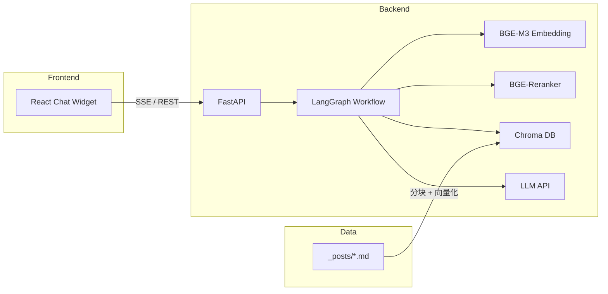

# 技术栈选型文档

| 属性 | 内容 |
| --- | --- |
| **文档版本** | v1.0.0 |
| **创建日期** | 2026-08-26 |
| **负责人** | 123XH-sudo |
| **状态** | 已评审 |

---

## 更新记录

| 版本 | 日期 | 变更内容 | 变更人 | 评审状态 |
| --- | --- | --- | --- | --- |
| v1.0.0 | 2026-08-26 | 初版技术栈评估与选型确认 | 123XH-sudo | 已通过 |

---

## 1. 架构总览



---

## 2. 技术栈清单

### 2.1 核心组件

| 层级 | 技术 | 版本（目标） | 用途 |
| --- | --- | --- | --- |
| 工作流编排 | LangGraph | ≥ 0.2.x | RAG 全链路状态图编排 |
| LLM 框架 | LangChain | ≥ 0.3.x | Document Loader、Text Splitter、LLM 抽象 |
| 向量数据库 | Chroma | ≥ 0.5.x | 本地持久化向量存储与检索 |
| Embedding | BGE-M3 (BAAI/bge-m3) | latest | 多语言、8192 token、1024 维向量 |
| Reranker | BGE-Reranker-v2-m3 | latest | Cross-Encoder 二次排序 |
| Web 框架 | FastAPI | ≥ 0.115.x | 异步 API + SSE 流式响应 |
| 前端 | React | ≥ 18.x | 聊天 UI 组件 |
| 构建工具 | Vite | ≥ 5.x | 前端开发与打包 |
| 运行时 | Python | ≥ 3.10 | 后端 |
| 运行时 | Node.js | ≥ 18 | 前端构建 |

### 2.2 辅助工具

| 工具 | 版本 | 用途 |
| --- | --- | --- |
| Pydantic | ≥ 2.x | 请求/响应模型校验 |
| python-dotenv | latest | 环境变量管理 |
| PyYAML | latest | 解析 Jekyll front matter |
| httpx / aiohttp | latest | 异步 LLM API 调用 |
| FlagEmbedding | latest | 本地加载 BGE 模型 |
| uv / pip | — | Python 依赖管理 |
| Docker（可选） | ≥ 24 | 容器化部署 |

---

## 3. 选型理由与替代方案

### 3.1 LangGraph（工作流编排）

**选型理由**

- 图结构支持条件分支（如检索置信度低时走澄清/降级路径）
- 每个节点对应独立状态，便于单步调试与 LangSmith 可视化
- 相比 LangChain Chain 的线性流程，扩展「问题改写」「多轮记忆」节点成本更低

**替代方案**

| 方案 | 优势 | 劣势 | 迁移成本 |
| --- | --- | --- | --- |
| LangChain LCEL Chain | 上手快，文档多 | 线性流程，分支/循环难表达 | 中 — 需重写编排层 |
| 纯 Python 函数管道 | 零依赖，完全可控 | 无可视化，状态管理自建 | 低 — 但失去生态工具 |
| Dify 低代码平台 | 已接入（现有 workflow） | 黑盒，难以深度定制与学习 | 无（当前方案） |

**结论**：学习导向 + 需要灵活扩展节点 → **选用 LangGraph**

---

### 3.2 Chroma（向量数据库）

**选型理由**

- 嵌入式部署，无需独立服务，适合个人博客规模（< 1000 chunk）
- Python 原生 API，与 LangChain 集成成熟
- 支持持久化、metadata 过滤、增量 upsert

**替代方案**

| 方案 | 优势 | 劣势 | 迁移成本 |
| --- | --- | --- | --- |
| Milvus | 分布式、百万级向量 | 需 Docker 独立服务，运维重 | 高 |
| Pinecone | 全托管、免运维 | 云服务费用、数据出境 | 中 |
| FAISS | 性能极高 | 无服务端、无 metadata 过滤 | 中 |
| pgvector | 与 PostgreSQL 统一存储 | 个人项目无 PG 需求，过度设计 | 高 |

**结论**：个人博客 + 快速验证 → **选用 Chroma**（已在 [向量库选型博客](../../_posts/2026-08-08-vector-database.md) 中论证）

---

### 3.3 BGE-M3 + BGE-Reranker（检索模型）

**选型理由**

- BGE-M3：中文效果领先，支持 dense/sparse/multi-vector，8192 token 适合长文
- BGE-Reranker：Cross-Encoder 精度高于 Bi-Encoder 相似度，适合 Top-K 重排
- 均可本地推理，无 API 费用

**替代方案**

| 方案 | 优势 | 劣势 | 迁移成本 |
| --- | --- | --- | --- |
| OpenAI text-embedding-3 | 免本地 GPU | 按量付费、网络依赖 | 低 — 换 Embedding 接口 |
| Cohere Rerank API | 效果好 | 付费、延迟 | 低 |
| BM25 only | 零模型依赖 | 语义理解弱 | 低 — 可作为 Hybrid 组件保留 |

**结论**：Hybrid（向量 + BM25）+ BGE-Reranker 组合 → **选用 BGE 系列**

---

### 3.4 FastAPI（后端框架）

**选型理由**

- 原生 async/await，适合 SSE 流式与并发 LLM 调用
- Pydantic 自动校验 + OpenAPI 文档
- Python AI 生态（LangChain/LangGraph）同语言，避免跨语言调试

**替代方案**

| 方案 | 优势 | 劣势 | 迁移成本 |
| --- | --- | --- | --- |
| Flask | 简单熟悉 | 同步为主，SSE 需额外处理 | 中 |
| NestJS | 工程化强 | 与 Python AI 库割裂 | 高 |
| Django | 全家桶 | 过重，不适合纯 API 服务 | 高 |

**结论**：Python AI 栈 + 流式 API → **选用 FastAPI**

---

### 3.5 React（前端）

**选型理由**

- 组件化开发聊天 UI，状态管理清晰
- 生态成熟（Markdown 渲染、SSE 客户端）
- 与现有 `chat-widget.html` 功能对齐，可逐步迁移

**替代方案**

| 方案 | 优势 | 劣势 | 迁移成本 |
| --- | --- | --- | --- |
| 原生 JS（现状） | 零构建，直接嵌入 Jekyll | 难维护，无组件复用 | 无（当前） |
| Vue 3 | 上手快 | 生态与个人熟悉度 | 中 |
| Next.js | SSR 能力强 | 博客已是 Jekyll，过度设计 | 高 |

**结论**：独立聊天组件 + 可维护性 → **选用 React + Vite**，构建产物嵌入 Jekyll

---

## 4. 技术栈适用性评估

| 维度 | 评分 (1-5) | 说明 |
| --- | --- | --- |
| 学习价值 | 5 | 覆盖 RAG 全链路主流技术 |
| 个人博客适配 | 5 | 轻量、本地、无运维负担 |
| 社区与文档 | 4 | LangGraph 较新，文档在快速完善 |
| 部署复杂度 | 4 | 模型下载是主要门槛 |
| 扩展性 | 4 | LangGraph 节点可扩展；Chroma 有规模上限 |
| 总体推荐 | **推荐采用** | 符合项目目标，暂不建议替换 |

---

## 5. 已知限制与后续优化方向

| 限制 | 触发条件 | 建议方案 |
| --- | --- | --- |
| Chroma 单机性能 | chunk > 10 万 | 迁移 Milvus 或 Qdrant |
| BGE 本地推理慢 | 无 GPU | 使用 ONNX 量化或 API Embedding |
| LangGraph 学习曲线 | 新手调试困难 | 先用最小图（3 节点），逐步加节点 |
| React 构建嵌入 Jekyll | 双构建流程 | CI 中先 build 前端再 build Jekyll |

---

## 6. 项目目录规划（与技术栈对应）

```
123xh-sudo.github.io/
├── _posts/                    # 博客数据源（Jekyll）
├── docs/                      # 项目文档（本目录）
├── rag-backend/               # FastAPI + LangGraph + Chroma
│   ├── app/
│   │   ├── main.py
│   │   ├── graph/             # LangGraph 工作流
│   │   ├── retrieval/         # 检索 + Rerank
│   │   ├── ingestion/         # 分块 + Embedding + 入库
│   │   └── config.py
│   ├── requirements.txt
│   └── .env.example
├── rag-frontend/              # React + Vite
│   ├── src/
│   └── package.json
├── chunk_blog.py              # 已有分块脚本（逐步迁入 rag-backend）
└── _includes/chat-widget.html # 逐步替换为 React 构建产物
```

---

## 7. 技术栈变更流程

1. 发现更优方案或遇到不可克服的技术障碍
2. 撰写变更提案：理由、优势对比、迁移成本、影响范围
3. 技术评审通过后更新本文档「更新记录」
4. 同步更新需求文档与开发计划中受影响阶段
5. 开发严格遵循最新版本技术栈文档
